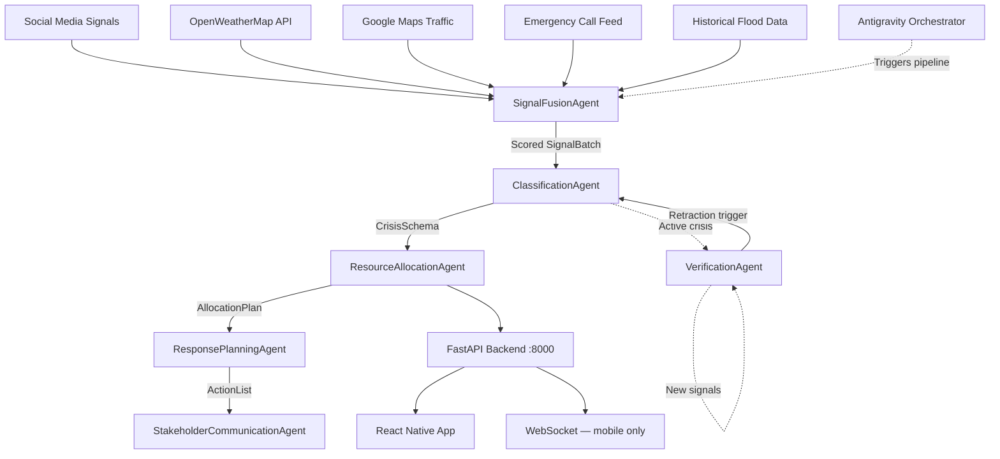

# CIRO — Complete Antigravity Build Prompts (v2 — All Fixes Applied)
### AI Seekho 2026 · Google Antigravity Hackathon · Challenge 3

---

> **How to use these prompts:** Run them in order. Each prompt is a complete, standalone instruction.
> Paste it into Antigravity's agent or code generation interface. Wait for completion before running
> the next. Where a prompt says "FILE: filename.py already exists," it means you produced that file
> in a prior step.
>
> **v2 Changes:** Fixed Gemini model names, frequency score formula, SeverityLevel enum pattern,
> Antigravity native manifest format, WebSocket architecture clarification, mobile error states,
> test assertion quality, Gemini auth pattern, demo scenario construction, and README placeholders.
> Added Prompt 0.2 (Antigravity Project Manifest) — run this before anything else.

---

## PHASE 0 — PROJECT BOOTSTRAP

### Prompt 0.1 — Environment & Repository Setup

```
You are an expert Python/React Native engineer setting up a production-grade multi-agent crisis
response system called CIRO (Crisis Intelligence & Response Orchestrator) for a hackathon submission.

Create the complete project scaffold with the following exact folder structure:

ciro/
├── backend/
│   ├── api/
│   │   ├── __init__.py
│   │   ├── signals.py
│   │   ├── crisis.py
│   │   ├── resources.py
│   │   ├── actions.py
│   │   └── alerts.py
│   ├── models/
│   │   ├── __init__.py
│   │   ├── signal_models.py
│   │   ├── crisis_models.py
│   │   └── resource_models.py
│   ├── data/
│   │   ├── __init__.py
│   │   ├── generators.py
│   │   └── flood_zones.json
│   ├── services/
│   │   ├── __init__.py
│   │   └── tools.py
│   ├── agents/
│   │   └── __init__.py
│   ├── intelligence/
│   │   ├── __init__.py
│   │   ├── credibility.py
│   │   ├── classifier.py
│   │   ├── verifier.py
│   │   ├── metrics.py
│   │   └── baseline.py
│   ├── reasoning/
│   │   ├── __init__.py
│   │   ├── resource_model.py
│   │   ├── allocation.py
│   │   ├── multi_crisis.py
│   │   ├── stakeholder_messages.py
│   │   └── comparison_report.py
│   ├── main.py
│   ├── requirements.txt
│   ├── Dockerfile
│   ├── docker-compose.yml
│   └── .env.example
├── mobile/
│   └── (React Native Expo project — scaffolded separately)
├── antigravity.yaml          ← NEW: Antigravity project manifest
└── README.md

For requirements.txt, include:
fastapi==0.111.0
uvicorn[standard]==0.30.1
pydantic==2.7.1
pydantic-settings==2.3.0
httpx==0.27.0
python-dotenv==1.0.1
websockets==12.0
google-generativeai==0.7.2
openai==1.35.0
requests==2.32.3
pytest==8.2.2
pytest-asyncio==0.23.7
faker==25.3.0
geojson==3.1.0
python-jose==3.3.0
aiofiles==23.2.1

For .env.example:
OPENWEATHERMAP_API_KEY=your_key_here
GOOGLE_MAPS_API_KEY=your_key_here
GEMINI_API_KEY=your_key_here
ANTIGRAVITY_PROJECT_ID=your_project_id
BACKEND_URL=http://localhost:8000
ENVIRONMENT=development
PORT=8000
LOG_LEVEL=INFO

For Dockerfile:
FROM python:3.11-slim
WORKDIR /app
COPY requirements.txt .
RUN pip install --no-cache-dir -r requirements.txt
COPY . .
EXPOSE 8000
CMD ["uvicorn", "main:app", "--host", "0.0.0.0", "--port", "8000"]

For docker-compose.yml:
version: '3.8'
services:
  backend:
    build: ./backend
    ports:
      - "8000:8000"
    env_file:
      - ./backend/.env
    volumes:
      - ./backend:/app
    command: uvicorn main:app --host 0.0.0.0 --port 8000 --reload

Create all __init__.py files as empty files. Create flood_zones.json as a valid GeoJSON
FeatureCollection with 5 high-flood-risk zones in Islamabad (G-10, G-11, I-8, Rawal Town,
Sector F-6) and 3 in Lahore (Model Town, Gulberg, DHA Phase 4). Each feature should have
properties: zone_name, city, risk_level (high/critical), historical_flood_count,
population_estimate.

Output each file with its full path and complete content. Do not use placeholder comments —
write real, complete code for every file.
```

---

### Prompt 0.2 — Antigravity Project Manifest ← NEW (Run Before Phase 1)

```
You are configuring the Google Antigravity project manifest for CIRO. This YAML file is uploaded
directly to the Antigravity console and instantiates the entire multi-agent pipeline in one step.
Without this file, no agents can run.

Create antigravity.yaml at the project root (next to README.md):

IMPORTANT ARCHITECTURE NOTE — read before writing the manifest:
Antigravity agents are stateless, per-request invocations. They are NOT daemons and do NOT
subscribe to WebSockets. The FastAPI WebSocket endpoint (/ws/signals) serves the React Native
mobile app only. Antigravity agents are triggered by:
  (a) A manual POST to /agents/run from the demo control endpoint, OR
  (b) A scheduled trigger (Cloud Scheduler, every 60 seconds in production)
Each agent reads its input from an HTTP GET/POST against the FastAPI backend, not from a
persistent stream. The SignalFusionAgent calls GET /signals/stream to read the last 50 buffered
signals on each invocation.

The manifest must declare:

1. PROJECT METADATA
   name: ciro-crisis-intelligence
   display_name: "CIRO — Crisis Intelligence & Response Orchestrator"
   description: "Multi-agent urban crisis detection and response system for Pakistani cities"
   region: asia-south1        # closest GCP region to Pakistan
   project_id: ${ANTIGRAVITY_PROJECT_ID}

2. ENVIRONMENT VARIABLES (referenced throughout as ${VAR_NAME})
   BACKEND_URL: the FastAPI base URL
   GEMINI_API_KEY: for Gemini calls within agent prompts

3. ALL 6 AGENT DEFINITIONS — for each agent specify:
   id: snake_case identifier
   display_name: human-readable name
   model: gemini-2.5-flash-preview-05-20    ← use this exact model string for ALL agents
   tools: list of HTTP tool bindings (method, url, input_schema_ref, output_schema_ref)
   system_instruction: |  (multiline, brief 2-sentence summary — full prompts are in agent_configs.py)
   output_schema: JSON schema reference for structured output

   Agent definitions:
   
   signal_fusion_agent:
     tools:
       - id: credibility_scoring
         type: http
         method: POST
         url: "${BACKEND_URL}/signals/ingest"
       - id: get_signal_stream
         type: http
         method: GET
         url: "${BACKEND_URL}/signals/stream"
     output_schema: SignalBatch
   
   classification_agent:
     tools:
       - id: classify_crisis
         type: http
         method: POST
         url: "${BACKEND_URL}/crisis/detect"
     output_schema: CrisisSchema
   
   resource_allocation_agent:
     tools:
       - id: get_inventory
         type: http
         method: GET
         url: "${BACKEND_URL}/resources/inventory"
       - id: allocate_resources
         type: http
         method: POST
         url: "${BACKEND_URL}/resources/allocate"
     output_schema: AllocationPlan
   
   response_planning_agent:
     tools:
       - id: simulate_actions
         type: http
         method: POST
         url: "${BACKEND_URL}/actions/simulate"
     output_schema: ActionPlan
   
   stakeholder_communication_agent:
     tools:
       - id: broadcast_alerts
         type: http
         method: POST
         url: "${BACKEND_URL}/alerts/broadcast"
     output_schema: StakeholderMessages
   
   verification_agent:
     tools:
       - id: verify_false_positive
         type: http
         method: POST
         url: "${BACKEND_URL}/crisis/verify"
       - id: retract_crisis
         type: http
         method: POST
         url: "${BACKEND_URL}/crisis/retract/{crisis_id}"
     output_schema: FalsePositiveResult

4. ORCHESTRATION PIPELINE
   Define the execution flow:
   pipeline:
     id: ciro_main_pipeline
     trigger:
       type: http
       endpoint: /agents/run
     steps:
       - agent: signal_fusion_agent
         id: step_fusion
       - agent: classification_agent
         id: step_classify
         depends_on: [step_fusion]
       - agent: resource_allocation_agent
         id: step_allocate
         depends_on: [step_classify]
       - agent: response_planning_agent
         id: step_plan
         depends_on: [step_allocate]
       - agent: stakeholder_communication_agent
         id: step_communicate
         depends_on: [step_plan]
     parallel_monitors:
       - agent: verification_agent
         id: step_verify
         trigger: on_new_signal   # runs independently when new signals arrive

5. TRACE LOGGING
   tracing:
     enabled: true
     level: verbose
     export_to: cloud_storage
     bucket: "${ANTIGRAVITY_PROJECT_ID}-traces"
     include_reasoning: true
     include_tool_calls: true
     include_tool_results: true

6. INPUT/OUTPUT SCHEMAS (inline JSON Schema)
   Define SignalBatch, CrisisSchema, AllocationPlan, StakeholderMessages, FalsePositiveResult
   as $defs references so agents can validate their inputs/outputs.
   Use the exact field names from the Pydantic models in backend/models/.

Output the complete antigravity.yaml. Every field must be present — no placeholder comments.
Validate that all agent IDs referenced in the pipeline steps match the agent definition IDs.
```

---

## PHASE 1 — PYDANTIC MODELS & SCHEMAS

### Prompt 1.1 — All Data Models

```
You are building CIRO, a crisis intelligence system. Create all Pydantic v2 models for the
FastAPI backend. These models are the contract between all system components — they must be
precise, well-validated, and include examples.

FILE: backend/models/signal_models.py

Create these Pydantic BaseModel classes:

1. SignalSource — Enum: SOCIAL_MEDIA, WEATHER_API, GOOGLE_MAPS, EMERGENCY_CALL, HISTORICAL_DATA

2. RawSignal — fields:
   - signal_id: str (UUID default)
   - source_type: SignalSource
   - content: str (the raw text or data string)
   - location: str (e.g. "G-10, Islamabad")
   - latitude: float (between 30.0 and 34.0 for Pakistan)
   - longitude: float (between 71.0 and 75.0 for Pakistan)
   - timestamp: datetime (default now)
   - recency_minutes: int (0-1440)
   - mention_frequency: int (1-500)
   - geo_precision: float (0.0-1.0)
   - raw_metadata: dict (optional, default {})
   Include model_config with json_schema_extra showing a complete example.

3. ScoredSignal — extends RawSignal, adds:
   - credibility_score: float (0.0-1.0)
   - credibility_explanation: dict

4. SignalBatch — fields:
   - batch_id: str (UUID)
   - signals: list[ScoredSignal]
   - batch_timestamp: datetime
   - scenario_tag: str | None
   - reasoning_log: list[str] (default []) ← stores agent step reasoning

FILE: backend/models/crisis_models.py

1. CrisisType — Enum: FLOOD, HEATWAVE, ACCIDENT, INFRASTRUCTURE, FIRE, UNKNOWN

2. SeverityLevel — Enum: LOW, MEDIUM, HIGH, CRITICAL
   
   IMPORTANT: Do NOT add methods to the enum class itself — Pydantic v2 does not
   serialize enum methods reliably. Instead, define a module-level lookup dict:
   
   class SeverityLevel(str, Enum):
       LOW = "low"
       MEDIUM = "medium"
       HIGH = "high"
       CRITICAL = "critical"
   
   SEVERITY_SCORES: dict[SeverityLevel, int] = {
       SeverityLevel.LOW: 1,
       SeverityLevel.MEDIUM: 2,
       SeverityLevel.HIGH: 3,
       SeverityLevel.CRITICAL: 4,
   }
   
   def get_severity_score(level: SeverityLevel) -> int:
       """Module-level helper. Use this instead of a method on the enum."""
       return SEVERITY_SCORES[level]
   
   Export both SEVERITY_SCORES and get_severity_score from this module.
   All downstream code (multi_crisis.py, allocation.py) must import and use
   get_severity_score(crisis.severity) — never crisis.severity.get_score().

3. CrisisSchema — core output of the classification agent:
   - crisis_id: str (UUID)
   - type: CrisisType
   - severity: SeverityLevel
   - confidence: float (0.0-1.0)
   - affected_radius_km: float
   - location: str
   - latitude: float
   - longitude: float
   - detected_at: datetime
   - explanation: str
   - contributing_signals: list[str] (signal_ids)
   - is_active: bool (default True)
   - retracted: bool (default False)
   - retraction_reason: str | None
   - reasoning_log: list[str] (default [])

4. FalsePositiveResult — fields:
   - original_crisis_id: str
   - contradiction_score: float
   - retract: bool
   - correction: str
   - corrected_type: CrisisType | None
   - log_entry: str
   - correction_timestamp: datetime
   - verification_log: list[str] (default []) ← agent reasoning steps

FILE: backend/models/resource_models.py

1. ResourceType — Enum: AMBULANCE, POLICE_UNIT, RESCUE_TEAM, WATER_TANKER,
                        MEDICAL_OUTREACH, FIRE_ENGINE

2. ResourceStatus — Enum: AVAILABLE, DEPLOYED, EN_ROUTE, UNAVAILABLE

3. Resource — fields:
   - resource_id: str (UUID)
   - type: ResourceType
   - status: ResourceStatus (default AVAILABLE)
   - current_location: str
   - current_lat: float
   - current_lng: float
   - travel_time_by_zone: dict[str, int]
   - unit_name: str
   - capacity: int

4. AllocationItem — fields:
   - resource_id: str
   - resource_type: ResourceType
   - unit_name: str
   - destination: str
   - eta_minutes: int
   - reasoning: str

5. AllocationPlan — fields:
   - plan_id: str (UUID)
   - crisis_id: str
   - allocations: list[AllocationItem]
   - unmet_needs: list[str]
   - total_deployed: int
   - allocation_reasoning: str
   - created_at: datetime

6. MultiCrisisAllocationPlan — fields:
   - plan_id: str (UUID)
   - crisis_plans: dict[str, AllocationPlan]
   - conflict_resolution_log: list[str]
   - priority_order: list[str]
   - created_at: datetime

7. StakeholderMessages — fields:
   - crisis_id: str
   - public_urdu: str
   - public_english: str
   - hospital_request: str
   - utility_alert: str
   - transport_rerouting: str
   - media_briefing: str
   - generated_at: datetime

8. BeforeAfterState — fields:
   - scenario_id: str
   - before: dict
   - after: dict
   - improvement_metrics: dict
   - generated_at: datetime

All models: model_config with populate_by_name=True. Every model must have
json_schema_extra with realistic Pakistani city data. All field validators where appropriate.
```

---

## PHASE 2 — INTELLIGENCE MODULES

### Prompt 2.1 — Signal Credibility Scoring

```
You are building the signal intelligence engine for CIRO. Create backend/intelligence/credibility.py
with a complete, production-quality SignalCredibility class.

Requirements:

class SignalCredibility:
    """
    Computes a weighted credibility score for each incoming signal.
    Used by the SignalFusionAgent before classification.
    """
    
    WEIGHTS = {
        "source": 0.35,
        "recency": 0.25,
        "frequency": 0.25,
        "geo": 0.15
    }
    
    SOURCE_BASE_SCORES = {
        SignalSource.WEATHER_API: 0.95,
        SignalSource.GOOGLE_MAPS: 0.90,
        SignalSource.HISTORICAL_DATA: 0.85,
        SignalSource.EMERGENCY_CALL: 0.88,
        SignalSource.SOCIAL_MEDIA: 0.60
    }

    Methods:
    
    1. score_signal(signal: RawSignal) -> ScoredSignal
       Full pipeline: compute all 4 component scores, weighted sum, add explanation dict.
    
    2. _compute_source_score(source_type: SignalSource, recency_minutes: int = 0) -> float
       Returns base score from SOURCE_BASE_SCORES.
       Social media gets additional penalty if recency_minutes > 30: multiply by 0.85.
    
    3. _compute_recency_score(recency_minutes: int) -> float
       Exponential decay: score = e^(-recency_minutes / 60).
       At 0 min = 1.0. At 60 min ≈ 0.37. At 120 min ≈ 0.14.
    
    4. _compute_frequency_score(mention_frequency: int) -> float
       Logarithmic scaling using this EXACT formula:
       
       score = min(1.0, max(0.0,
           (math.log(1 + mention_frequency) - math.log(2)) /
           (math.log(51) - math.log(2))
       ))
       
       This formula is zero-anchored at frequency=1 and reaches 1.0 at frequency=50.
       Verified values (include these as inline comments):
         frequency=1  → 0.00
         frequency=5  → 0.36
         frequency=20 → 0.68
         frequency=50 → 1.00
       
       Do NOT use the formula log(1+f)/log(50) — that formula produces 0.18 at f=1,
       which is inconsistent with the intended zero-anchor behavior.
    
    5. _compute_geo_score(geo_precision: float) -> float
       Direct passthrough with a floor of 0.1:
       return max(0.1, geo_precision)
    
    6. score_batch(signals: list[RawSignal]) -> list[ScoredSignal]
       Score all signals, sort by credibility_score descending.
    
    7. get_top_signals(signals: list[RawSignal], top_n: int = 5) -> list[ScoredSignal]
       Score and return top N.

The explanation dict must contain:
{
  "source_score": float,
  "source_weight": 0.35,
  "recency_score": float,
  "recency_weight": 0.25,
  "frequency_score": float,
  "frequency_weight": 0.25,
  "geo_score": float,
  "geo_weight": 0.15,
  "composite_score": float,
  "dominant_factor": str
}

Also write a complete test suite (10+ test cases) at the bottom under
if __name__ == "__main__": that demonstrates:
- A high-credibility weather API signal → credibility_score > 0.88
- A low-credibility old social media post (recency=120 min) → credibility_score < 0.45
- A medium-credibility emergency call with imprecise location → 0.45 < score < 0.75
- frequency=1 → frequency_score == 0.0 (EXACT, not approximate)
- frequency=50 → frequency_score == 1.0 (EXACT)
- Batch scoring of 5 mixed signals — verify sorted descending
- Verification that weights sum to 1.0 exactly
- Social media with recency > 30 min gets lower source_score than same with recency < 30 min
Print "ALL CREDIBILITY TESTS PASSED" if all assertions pass.

Import from models using relative imports. Use math.log and math.exp — no numpy or scipy.
```

---

### Prompt 2.2 — Crisis Classifier

```
You are building the crisis classification engine for CIRO.
Create backend/intelligence/classifier.py with a complete CrisisClassifier class.

IMPORTANT: Import get_severity_score from models.crisis_models (not a method on SeverityLevel).
The SeverityLevel enum does NOT have a get_score() method — use the module-level function.

The classifier takes a list of ScoredSignal objects and produces a CrisisSchema. It uses
multi-signal fusion — no single signal drives the classification.

class CrisisClassifier:
    """
    Multi-signal crisis classification using weighted voting and
    threshold-based severity assignment. Fully deterministic and explainable.
    """

    CRISIS_KEYWORDS = {
        CrisisType.FLOOD: {
            "urdu_roman": ["pani bhar gaya", "sailaab", "baarish", "tayfaan",
                           "nali bhari", "khet doob gaye"],
            "english": ["flood", "flooding", "waterlogged", "submerged",
                        "overflow", "inundation", "standing water", "drainage blocked"]
        },
        CrisisType.HEATWAVE: {
            "urdu_roman": ["garmi", "luu", "heat stroke", "paani khatam", "tapish"],
            "english": ["heatwave", "heat wave", "extreme heat", "temperature spike",
                        "heat stroke", "heat advisory", "temperature above 40"]
        },
        CrisisType.ACCIDENT: {
            "urdu_roman": ["haadsa", "takkar", "car accident", "road block", "aag lag gayi"],
            "english": ["accident", "collision", "crash", "road block",
                        "pile-up", "overturned", "emergency"]
        },
        CrisisType.INFRASTRUCTURE: {
            "urdu_roman": ["bijli gayi", "paani band", "main burst",
                           "pipe phoot", "transformer"],
            "english": ["power outage", "water main", "pipe burst",
                        "infrastructure failure", "utility failure", "transformer fire"]
        },
        CrisisType.FIRE: {
            "urdu_roman": ["aag", "dhuaan", "jal raha"],
            "english": ["fire", "smoke", "blaze", "burning", "firefighter"]
        }
    }

    SEVERITY_THRESHOLDS = {
        "critical": (0.85, 4, 0.7),
        "high":     (0.70, 3, 0.5),
        "medium":   (0.55, 2, 0.3),
        "low":      (0.0,  1, 0.0)
    }

    SOURCE_SEVERITY_BOOST = {
        SignalSource.WEATHER_API:     {"FLOOD": 1, "HEATWAVE": 1},
        SignalSource.EMERGENCY_CALL:  {"FLOOD": 1, "ACCIDENT": 1, "FIRE": 1},
        SignalSource.GOOGLE_MAPS:     {"ACCIDENT": 1, "FLOOD": 1}
    }

    Methods:
    
    1. classify(signals: list[ScoredSignal], location: str = None) -> CrisisSchema
       a) Keyword matching across all signal contents
       b) Vote-weight each crisis type by sum of credibility scores of matching signals
       c) Select winning type (highest weighted vote)
       d) confidence = (winning_type_score / total_score) clamped to 0.0-1.0
       e) Apply SOURCE_SEVERITY_BOOST
       f) Estimate affected_radius_km
       g) Build and return CrisisSchema with reasoning_log populated
    
    2. _score_signals_for_type(signals, crisis_type) -> float
    
    3. _compute_severity(signals, crisis_type) -> SeverityLevel
       Use SEVERITY_THRESHOLDS. Boost if high-authority sources present.
    
    4. _estimate_radius(crisis_type, severity) -> float
       FLOOD:          LOW=0.5, MEDIUM=1.2, HIGH=2.5, CRITICAL=4.0
       HEATWAVE:       LOW=2.0, MEDIUM=4.0, HIGH=8.0, CRITICAL=15.0
       ACCIDENT:       LOW=0.1, MEDIUM=0.3, HIGH=0.5, CRITICAL=1.0
       INFRASTRUCTURE: LOW=0.2, MEDIUM=0.8, HIGH=1.5, CRITICAL=3.0
       FIRE:           LOW=0.1, MEDIUM=0.5, HIGH=1.0, CRITICAL=2.0
    
    5. _build_explanation(signals, winner, confidence, severity) -> str
       3-5 sentence human-readable string. Include: crisis type, severity, confidence,
       count of matching signals per source, what triggered any severity boost.

Write complete tests: G-10 flood (5 mixed signals), Gulberg heatwave (3 signals),
ambiguous conflicting signals (3 flood + 3 heatwave — verify it picks flood or heatwave
consistently, not UNKNOWN). Print "ALL CLASSIFIER TESTS PASSED".
```

---

### Prompt 2.3 — False Positive Verifier

```
You are building the false positive detection system for CIRO.
Create backend/intelligence/verifier.py.

IMPORTANT: Import get_severity_score from models.crisis_models, not from SeverityLevel enum.

class FalsePositiveVerifier:
    """
    Detects when a contradicting signal invalidates an existing crisis classification.
    """
    
    RETRACTION_THRESHOLD = 0.60
    
    CORRECTION_KEYWORDS = {
        "water main burst": {
            "replaces": CrisisType.FLOOD,
            "corrects_to": CrisisType.INFRASTRUCTURE,
            "contradiction_weight": 0.85
        },
        "pipe burst": {
            "replaces": CrisisType.FLOOD,
            "corrects_to": CrisisType.INFRASTRUCTURE,
            "contradiction_weight": 0.80
        },
        "sprinkler": {
            "replaces": CrisisType.FLOOD,
            "corrects_to": None,
            "contradiction_weight": 0.75
        },
        "controlled burn": {
            "replaces": CrisisType.FIRE,
            "corrects_to": None,
            "contradiction_weight": 0.70
        },
        "training exercise": {
            "replaces": CrisisType.ACCIDENT,
            "corrects_to": None,
            "contradiction_weight": 0.80
        },
        "false alarm": {
            "replaces": None,
            "corrects_to": None,
            "contradiction_weight": 0.65
        },
        "road repair": {
            "replaces": CrisisType.ACCIDENT,
            "corrects_to": CrisisType.INFRASTRUCTURE,
            "contradiction_weight": 0.70
        }
    }

    AUTHORITATIVE_SOURCES = [SignalSource.EMERGENCY_CALL, SignalSource.WEATHER_API]

    Methods:
    
    1. verify(new_signal: ScoredSignal, active_crisis: CrisisSchema) -> FalsePositiveResult
       a) Keyword match in new_signal content
       b) No match → FalsePositiveResult(retract=False, contradiction_score=0.0)
       c) Compute contradiction_score:
          base = keyword contradiction_weight
          authority_boost = +0.15 if source in AUTHORITATIVE_SOURCES
          recency_bonus = +0.10 if signal recency_minutes < 5
          credibility_factor = new_signal.credibility_score * 0.20
          contradiction_score = min(1.0, base + authority_boost + recency_bonus + credibility_factor)
       d) retract = contradiction_score > RETRACTION_THRESHOLD
       e) Populate verification_log list with each computation step as a string
    
    2. _find_best_correction_keyword(content: str) -> tuple[str, dict] | None
    
    3. _build_log_entry(original, result, new_signal) -> str
       Detailed audit string including all score components and action taken.
    
    4. retract_and_update(crisis: CrisisSchema, result: FalsePositiveResult) -> CrisisSchema
       Returns updated CrisisSchema with retracted=True, is_active=False, retraction_reason set.
    
    5. batch_verify(new_signals, active_crises) -> list[FalsePositiveResult]

Tests:
- Water main burst → retract=True, contradiction_score > 0.60
- Generic weather update "heavy rain expected" → retract=False
- EMERGENCY_CALL source scores higher than SOCIAL_MEDIA for same content (authority boost test)
- Signal with recency_minutes=2 scores higher than recency_minutes=30 (recency bonus test)
- Batch verify: 3 active crises, 2 contradicting signals
Print "ALL VERIFIER TESTS PASSED".
```

---

### Prompt 2.4 — Evaluation Metrics & Baseline System

```
You are building the evaluation and comparison system for CIRO.
Create backend/intelligence/metrics.py and backend/intelligence/baseline.py.

IMPORTANT: Import get_severity_score from models.crisis_models throughout both files.

FILE: backend/intelligence/metrics.py

class EvaluationMetrics:
    """Computes performance metrics comparing CIRO vs baseline."""
    
    1. compute_detection_latency(signal_arrival_time: datetime,
                                  crisis_detected_time: datetime) -> int
       Returns milliseconds between first signal and classification output.
    
    2. compute_resource_efficiency(deployed_plan: AllocationPlan,
                                    optimal_plan: AllocationPlan) -> float
       Returns ratio: optimal_resources_needed / actual_resources_deployed.
       Clamp to 0.0-1.0.
    
    3. compute_false_positive_rate(total_alerts: int, false_positives: int) -> float
       Standard rate as percentage. Guard against division by zero (return 0.0 if total=0).
    
    4. compute_stakeholder_coverage(messages: StakeholderMessages) -> dict
       Returns:
       {
         "total_message_types": int,
         "has_urdu": bool,
         "has_english": bool,
         "has_hospital": bool,
         "has_utility": bool,
         "has_transport": bool,
         "has_media": bool,
         "coverage_score": float
       }
    
    5. generate_full_metrics_report(crisis, allocation, messages,
                                     detection_latency_ms, baseline_comparison) -> dict

FILE: backend/intelligence/baseline.py

class BaselineRuleSystem:
    """
    Simple keyword-matching rule-based system. Deliberately simple —
    this is the straw man CIRO clearly outperforms.
    """
    
    FLOOD_KEYWORDS = ["flood", "flooding", "pani", "bhar gaya", "sailaab", "waterlogged"]
    HEAT_KEYWORDS  = ["heat", "heatwave", "garmi", "temperature", "hot"]
    ACCIDENT_KEYWORDS = ["accident", "crash", "collision", "haadsa"]
    
    1. process_signals(signals: list[RawSignal]) -> dict
       Returns:
       {
         "alert_issued": bool,
         "alert_type": str,
         "location": str,                        # copied from first signal
         "message": str,                         # "Alert issued for area. Please be cautious."
         "severity": None,                       # BASELINE DOES NOT COMPUTE SEVERITY
         "confidence": None,                     # BASELINE HAS NO CONFIDENCE SCORE
         "resources_allocated": None,            # BASELINE DOES NOT ALLOCATE
         "stakeholder_messages": 1,              # always 1 generic message
         "false_positive_correction": False,     # BASELINE CANNOT CORRECT
         "processing_time_ms": int
       }
    
    2. _keyword_match(content: str) -> str | None

class ComparisonReport:
    """Side-by-side comparison table for README and demo."""
    
    1. generate(ciro_crisis, ciro_allocation, ciro_messages, ciro_latency_ms,
                baseline_result, baseline_latency_ms) -> dict
       
       Include rows:
       - Detection time
       - Crisis type accuracy
       - Severity scoring
       - Confidence score
       - Resources allocated
       - Stakeholder message types
       - Urdu language support
       - False positive correction
       - Explainability
       - Overall assessment
    
    2. format_as_markdown_table(comparison: dict) -> str
       GitHub-flavored markdown table with columns: Metric | Baseline | CIRO | Improvement
    
    3. format_as_dict_for_api(comparison: dict) -> dict

Print "ALL METRICS TESTS PASSED".
```

---

## PHASE 3 — RESOURCE ALLOCATION & MULTI-CRISIS COORDINATION

### Prompt 3.1 — Resource Model & Allocation Engine

```
You are building the resource allocation engine for CIRO.
Create backend/reasoning/resource_model.py and backend/reasoning/allocation.py.

IMPORTANT: Import get_severity_score and SEVERITY_SCORES from models.crisis_models.
Never call .get_score() on a SeverityLevel instance.

FILE: backend/reasoning/resource_model.py

Build ResourceInventory with all 47 resources pre-populated:
- 10 Ambulances: Rescue-1 through Rescue-10, distributed Islamabad(5), Lahore(3), Karachi(2)
- 15 Police Units: Traffic Police Alpha through Omega
- 8 Rescue Teams: Rescue Team Alpha through Theta
- 5 Water Tankers: Tanker-1 through Tanker-5
- 6 Medical Outreach Units: MOU-1 through MOU-6
- 3 Fire Engines: Fire Engine Red, Blue, Green

Each resource has realistic travel_time_by_zone for:
Islamabad: G-10, G-11, I-8, F-6, F-7, F-8, E-7, Rawal Town, Sector H, Blue Area
Lahore: Gulberg, Model Town, DHA Phase 4, Johar Town, Cantt, Walled City
Karachi: Clifton, PECHS, Korangi, Saddar

Realistic travel times (minutes): G-10→G-11=8, G-10→F-8=22, G-10→I-8=15, etc.

class ResourceInventory:
    def get_available(self, resource_type=None) -> list[Resource]
    def mark_deployed(self, resource_ids: list[str], destination: str) -> None
    def mark_available(self, resource_ids: list[str], location: str) -> None
    def get_eta(self, resource: Resource, destination_zone: str) -> int
        Same city unknown zone → 25 min. Different city → 180 min.
    def get_inventory_summary(self) -> dict
    def reset_all(self) -> None

FILE: backend/reasoning/allocation.py

class AllocationAlgorithm:

    RESOURCE_RELEVANCE = {
        CrisisType.FLOOD: {
            ResourceType.RESCUE_TEAM: 1.0, ResourceType.WATER_TANKER: 0.9,
            ResourceType.POLICE_UNIT: 0.7, ResourceType.AMBULANCE: 0.6,
            ResourceType.MEDICAL_OUTREACH: 0.3, ResourceType.FIRE_ENGINE: 0.1
        },
        CrisisType.HEATWAVE: {
            ResourceType.MEDICAL_OUTREACH: 1.0, ResourceType.AMBULANCE: 0.9,
            ResourceType.WATER_TANKER: 0.7, ResourceType.POLICE_UNIT: 0.3,
            ResourceType.RESCUE_TEAM: 0.2, ResourceType.FIRE_ENGINE: 0.1
        },
        CrisisType.ACCIDENT: {
            ResourceType.AMBULANCE: 1.0, ResourceType.POLICE_UNIT: 1.0,
            ResourceType.FIRE_ENGINE: 0.6, ResourceType.RESCUE_TEAM: 0.5,
            ResourceType.MEDICAL_OUTREACH: 0.4, ResourceType.WATER_TANKER: 0.1
        },
        CrisisType.FIRE: {
            ResourceType.FIRE_ENGINE: 1.0, ResourceType.AMBULANCE: 0.8,
            ResourceType.POLICE_UNIT: 0.7, ResourceType.RESCUE_TEAM: 0.6,
            ResourceType.MEDICAL_OUTREACH: 0.4, ResourceType.WATER_TANKER: 0.3
        },
        CrisisType.INFRASTRUCTURE: {
            ResourceType.POLICE_UNIT: 0.8, ResourceType.RESCUE_TEAM: 0.6,
            ResourceType.AMBULANCE: 0.4, ResourceType.WATER_TANKER: 0.5,
            ResourceType.FIRE_ENGINE: 0.3, ResourceType.MEDICAL_OUTREACH: 0.2
        }
    }
    
    SEVERITY_RESOURCE_COUNT = {
        SeverityLevel.CRITICAL: {ResourceType.RESCUE_TEAM: 3, ResourceType.AMBULANCE: 3,
                                  ResourceType.POLICE_UNIT: 4, ResourceType.WATER_TANKER: 3,
                                  ResourceType.MEDICAL_OUTREACH: 2, ResourceType.FIRE_ENGINE: 2},
        SeverityLevel.HIGH:     {ResourceType.RESCUE_TEAM: 2, ResourceType.AMBULANCE: 2,
                                  ResourceType.POLICE_UNIT: 3, ResourceType.WATER_TANKER: 2,
                                  ResourceType.MEDICAL_OUTREACH: 1, ResourceType.FIRE_ENGINE: 1},
        SeverityLevel.MEDIUM:   {ResourceType.RESCUE_TEAM: 1, ResourceType.AMBULANCE: 1,
                                  ResourceType.POLICE_UNIT: 2, ResourceType.WATER_TANKER: 1,
                                  ResourceType.MEDICAL_OUTREACH: 1, ResourceType.FIRE_ENGINE: 1},
        SeverityLevel.LOW:      {ResourceType.RESCUE_TEAM: 0, ResourceType.AMBULANCE: 1,
                                  ResourceType.POLICE_UNIT: 1, ResourceType.WATER_TANKER: 0,
                                  ResourceType.MEDICAL_OUTREACH: 1, ResourceType.FIRE_ENGINE: 0}
    }
    
    MAX_ALLOCATION_FRACTION = 0.60  # Never allocate > 60% of any type to one crisis

    Methods:
    
    1. allocate(crisis: CrisisSchema, inventory: ResourceInventory) -> AllocationPlan
       Sort by: (relevance * 1.0 - travel_time_normalized * 0.3).
       Enforce MAX_ALLOCATION_FRACTION per resource type.
       AllocationPlan must be built using model_validate(), not direct constructor:
       
       plan = AllocationPlan.model_validate({
           "plan_id": str(uuid4()),
           "crisis_id": crisis.crisis_id,
           "allocations": [item.model_dump() for item in allocation_items],
           "unmet_needs": unmet_needs,
           "total_deployed": len(allocation_items),
           "allocation_reasoning": reasoning_summary,
           "created_at": datetime.utcnow().isoformat()
       })
    
    2. _build_reasoning(resource, crisis, relevance, eta, rank) -> str
    
    3. _identify_unmet_needs(crisis, allocations, inventory) -> list[str]
    
    4. estimate_response_effectiveness(plan, crisis) -> float

Tests: FLOOD HIGH, HEATWAVE MEDIUM, insufficient resources scenario.
Print "ALL ALLOCATION TESTS PASSED".
```

---

### Prompt 3.2 — Multi-Crisis Coordination & Stakeholder Messages

```
You are building the multi-crisis coordination and communication modules for CIRO.

IMPORTANT: Import get_severity_score from models.crisis_models in both files.
Never call .get_score() on SeverityLevel.

FILE: backend/reasoning/multi_crisis.py

class MultiCrisisCoordinator:

    POPULATION_ESTIMATES = {
        "G-10": 85000, "G-11": 90000, "I-8": 75000, "F-6": 45000,
        "F-7": 55000, "F-8": 60000, "E-7": 40000, "Rawal Town": 120000,
        "Gulberg": 180000, "Model Town": 95000, "DHA Phase 4": 110000,
        "Johar Town": 130000, "Cantt": 85000
    }
    
    def coordinate(self, crises: list[CrisisSchema],
                   inventory: ResourceInventory) -> MultiCrisisAllocationPlan:
        """
        1. priority_score = get_severity_score(crisis.severity) * 2
                          + crisis.confidence * 1
                          + min(1.0, population/100000)
        2. Sort by priority_score descending
        3. Allocate to highest priority first (AllocationAlgorithm)
        4. Mark deployed in inventory
        5. Allocate remainder to next crisis
        6. Log every contention in conflict_resolution_log
        """
    
    def _compute_priority_score(self, crisis: CrisisSchema) -> float:
        severity_score = get_severity_score(crisis.severity)   # use module-level function
        population = self.POPULATION_ESTIMATES.get(
            crisis.location.split(",")[0].strip(), 50000
        )
        population_score = min(1.0, population / 100000)
        return severity_score * 2.0 + crisis.confidence * 1.0 + population_score
    
    def _log_conflict(self, resource_type, assigned_to, denied_to, reason) -> str
    
    def generate_trade_off_summary(self, plan: MultiCrisisAllocationPlan) -> str

FILE: backend/reasoning/stakeholder_messages.py

IMPORTANT AUTH PATTERN — use this exact initialization in __init__:

    import os
    import google.generativeai as genai
    
    class StakeholderMessageGenerator:
        def __init__(self):
            api_key = os.getenv("GEMINI_API_KEY")
            if api_key:
                genai.configure(api_key=api_key)
                self.gemini_available = True
                self.model = genai.GenerativeModel("gemini-2.5-flash-preview-05-20")
            else:
                self.gemini_available = False
                self.model = None

class StakeholderMessageGenerator:
    
    def generate_all(self, crisis: CrisisSchema, allocation: AllocationPlan,
                     use_gemini: bool = True) -> StakeholderMessages:
        if use_gemini and self.gemini_available:
            return self._generate_with_gemini(crisis, allocation)
        return self._generate_from_templates(crisis, allocation)
    
    def _generate_with_gemini(self, crisis, allocation) -> StakeholderMessages:
        System prompt: "You are the emergency communications officer for Pakistan's NDMA."
        
        User prompt must specify:
        - Crisis details (type, location, severity, affected radius)
        - Allocation (resource names + ETAs)
        - Required output: JSON with exactly these keys:
          public_urdu, public_english, hospital_request,
          utility_alert, transport_rerouting, media_briefing
        - public_urdu MUST be in Urdu script (Unicode), NOT Roman Urdu
        - Each message specific and actionable (real road/zone names)
        
        Response generation:
        response = self.model.generate_content(
            prompt,
            generation_config=genai.GenerationConfig(
                temperature=0.3,
                response_mime_type="application/json"
            )
        )
        
        Parse response.text as JSON. Wrap in try/except — fall back to templates on error.
        
        Build StakeholderMessages using model_validate():
        return StakeholderMessages.model_validate({
            "crisis_id": crisis.crisis_id,
            **parsed_json,
            "generated_at": datetime.utcnow().isoformat()
        })
    
    def _generate_from_templates(self, crisis, allocation) -> StakeholderMessages:
        All templates use {location}, {severity}, {crisis_type}, {eta} variables.
        
        public_urdu templates (actual Urdu script — copy exactly):
        FLOOD:    "خبردار! {location} میں شدید سیلاب کی صورتحال ہے۔ تمام مکینوں کو فوری طور پر محفوظ مقامات پر منتقل ہوجائیں۔ امدادی ٹیمیں {eta} منٹ میں پہنچ رہی ہیں۔"
        HEATWAVE: "گرمی کی لہر وارننگ: {location} میں درجہ حرارت خطرناک حد تک بڑھ گیا ہے۔ گھروں میں رہیں، پانی پیتے رہیں، طبی امداد کے لیے 1122 پر کال کریں۔"
        FIRE:     "آگ لگنے کی اطلاع: {location} میں آگ لگی ہے۔ فوری طور پر علاقہ خالی کریں۔ فائر بریگیڈ راستے میں ہے۔"
        ACCIDENT: "ٹریفک حادثہ: {location} پر سنگین حادثہ ہوا ہے۔ متبادل راستہ استعمال کریں۔ ہنگامی ٹیمیں موجود ہیں۔"
        INFRASTRUCTURE: "انفراسٹرکچر مسئلہ: {location} میں {crisis_type} کی وجہ سے خدمات متاثر ہیں۔ مرمتی کام جاری ہے۔"

Write tests for both Gemini (mock the API call) and template paths.
Mock pattern for Gemini test:
    from unittest.mock import MagicMock, patch
    with patch("google.generativeai.GenerativeModel") as mock_model:
        mock_model.return_value.generate_content.return_value.text = json.dumps({...})
Print "ALL STAKEHOLDER TESTS PASSED".
```

---

## PHASE 4 — MOCK DATA & SIGNAL GENERATORS

### Prompt 4.1 — All Five Signal Generators

```
You are building the data simulation layer for CIRO. Create backend/data/generators.py.

CRITICAL ARCHITECTURE NOTE:
The SignalStreamScheduler does NOT push to a WebSocket directly. The FastAPI WebSocket
endpoint (/ws/signals) maintains its own connection loop. The scheduler puts signals into
a shared asyncio.Queue or in-memory deque that the WebSocket handler reads from.
Design SignalStreamScheduler to write to a collections.deque(maxlen=200) signal buffer
that FastAPI's WebSocket handler drains. Do NOT pass a websocket object into the scheduler.

class SocialPostGenerator:
    FLOOD_POSTS_G10 = [
        {"urdu": "G-10/3 mein pani bhar gaya hai, gali number 4 band ho gayi. Koi rescue nahin aaya abhi tak!", "geo": "G-10, Islamabad", "urgency": 0.9},
        {"urdu": "Bahut zyada barish, G-10 markaz ke paas road block ho gayi water se", "geo": "G-10, Islamabad", "urgency": 0.7},
        {"urdu": "G-10/1 residents please evacuate, ground floor mein paani aa gaya hai", "geo": "G-10, Islamabad", "urgency": 0.95},
        {"urdu": "Cars floating in G-10 sector, Ring Road under 3 feet water", "geo": "Ring Road near G-10", "urgency": 0.92},
        {"urdu": "Emergency! G-10 nala overflowing. Please send help. Children trapped.", "geo": "G-10, Islamabad", "urgency": 1.0},
        {"urdu": "CCTV footage shows G-10 main bazar completely underwater", "geo": "G-10 Markaz", "urgency": 0.85}
    ]
    
    HEATWAVE_POSTS_GULBERG = [
        {"urdu": "Gulberg mein aj 43 degree temperature. 3 log heat stroke se hospital gaye", "geo": "Gulberg, Lahore", "urgency": 0.8},
        {"urdu": "WARNING: Extreme heat in Gulberg. Avoid going outside between 12-4pm", "geo": "Gulberg III, Lahore", "urgency": 0.75},
        {"urdu": "WASA paani band hai Gulberg mein, garmi mein pani ka bhi masla", "geo": "Gulberg, Lahore", "urgency": 0.7}
    ]
    
    FALSE_POSITIVE_POSTS = [
        {"urdu": "Update: jo G-10 mein paani tha wo actually water main burst tha, flood nahin", "geo": "G-10, Islamabad", "urgency": 0.6},
        {"urdu": "CLARIFICATION: Water in G-10 7th Avenue is from a burst water main, not flooding. Repair crew on site.", "geo": "G-10, Islamabad", "urgency": 0.5}
    ]
    
    Methods:
    1. generate_flood_scenario(location="G-10, Islamabad", count=5) -> list[RawSignal]
    2. generate_heatwave_scenario(location="Gulberg, Lahore", count=3) -> list[RawSignal]
    3. generate_false_positive_correction(original_location="G-10, Islamabad") -> list[RawSignal]
    4. generate_stream(scenario="g10_flood") -> list[RawSignal]
       Options: "g10_flood", "gulberg_heatwave", "dual_crisis", "false_positive", "robustness_test"

class WeatherMockAPI:
    ISLAMABAD_FLOOD_WEATHER = {
        "city": "Islamabad", "temperature_celsius": 28,
        "rainfall_mm_last_hour": 87.3, "wind_speed_kmh": 42,
        "humidity_percent": 94, "weather_condition": "Thunderstorm",
        "weather_alert": "FLOOD WATCH: Heavy rainfall expected to continue 3+ hours.",
        "forecast_6h_rainfall_mm": 45.0
    }
    
    LAHORE_HEATWAVE_WEATHER = {
        "city": "Lahore", "temperature_celsius": 43,
        "rainfall_mm_last_hour": 0, "wind_speed_kmh": 8,
        "humidity_percent": 15, "weather_condition": "Clear",
        "weather_alert": "HEAT WARNING: Temperature expected to reach 45°C.",
        "heat_index_celsius": 47.2
    }
    
    1. get_weather_signal(city: str, scenario: str) -> RawSignal
    2. get_real_weather(city: str, api_key: str) -> RawSignal | None
       Calls real OpenWeatherMap. Returns None on any failure (timeout, error, 4xx, 5xx).
       Endpoint: https://api.openweathermap.org/data/2.5/weather?q={city},PK&appid={api_key}&units=metric
       Set timeout=5 seconds on the requests.get() call.

class TrafficMockAPI:
    G10_FLOOD_TRAFFIC = {
        "affected_roads": ["G-10 Main Boulevard", "Ring Road Exit 5", "Margalla Road"],
        "congestion_levels": {"G-10 Main Boulevard": "SEVERE", "Ring Road Exit 5": "HEAVY", "Margalla Road": "MODERATE"},
        "incidents": [
            {"type": "ROAD_CLOSED", "location": "G-10/3 Main Gali", "cause": "Standing water"},
            {"type": "TRAFFIC_JAM", "location": "Ring Road near G-10 Interchange", "delay_minutes": 45}
        ],
        "alternate_routes": [
            {"from": "Ring Road", "to": "Islamabad Expressway", "via": "IJP Road", "added_time_min": 12},
            {"from": "G-10", "to": "G-8", "via": "Fazaia Road", "added_time_min": 8}
        ]
    }
    
    1. get_traffic_signal(location: str, scenario: str) -> RawSignal
    2. get_alternate_routes(location: str, scenario: str) -> list[dict]

class EmergencyCallFeed:
    1. get_call_spike_signal(location, calls_per_minute, scenario) -> RawSignal
       Normal baseline: 2 calls/min. Flood crisis: 18 calls/min.
    2. generate_call_log(scenario, duration_minutes=10) -> list[RawSignal]

class FloodZoneData:
    1. get_historical_signal(location: str) -> RawSignal
    2. get_zone_risk_level(location: str) -> str

class SignalStreamScheduler:
    """
    Maintains an internal signal buffer (collections.deque, maxlen=200).
    FastAPI WebSocket handler reads from this buffer — scheduler does NOT
    directly write to any WebSocket connection.
    """
    
    def __init__(self):
        self.buffer: collections.deque = collections.deque(maxlen=200)
        # initialize all 5 generators
    
    def get_scenario_signals(self, scenario: str = "g10_flood") -> list[RawSignal]:
        Returns complete signal set and pushes all signals to self.buffer.
        "g10_flood":       3 social + 1 weather + 1 traffic + 1 emergency_call + 1 historical = 7
        "gulberg_heatwave": 2 social + 1 weather + 1 medical_call = 4
        "dual_crisis":     g10_flood + gulberg_heatwave = 11
        "false_positive":  g10_flood signals + 2 correction signals = 9
        "robustness_test": 3 signals only (simulates missing data sources)
    
    def get_buffered_signals(self, max_count: int = 50) -> list[RawSignal]:
        Returns last max_count signals from buffer (for /signals/stream endpoint).
    
    async def generate_continuously(self, scenario: str, interval_seconds: float = 10.0):
        asyncio.Task that calls get_scenario_signals() every interval_seconds.
        Used as a FastAPI background task. Does NOT take a websocket parameter.

Print "ALL GENERATOR TESTS PASSED".
```

---

## PHASE 5 — FASTAPI BACKEND

### Prompt 5.1 — Complete FastAPI Application

```
You are building the complete FastAPI backend for CIRO.
Create backend/main.py and all router files.

IMPORTANT WEBSOCKET ARCHITECTURE:
The WebSocket endpoint reads from SignalStreamScheduler.buffer (a deque).
It does NOT pass itself to the scheduler. Pattern:

    @app.websocket("/ws/signals")
    async def websocket_signals(websocket: WebSocket):
        await websocket.accept()
        last_sent_index = 0
        try:
            while True:
                buffer_list = list(scheduler.buffer)
                new_signals = buffer_list[last_sent_index:]
                for signal in new_signals:
                    await websocket.send_json(signal.model_dump())
                last_sent_index = len(buffer_list)
                await asyncio.sleep(1.0)
        except WebSocketDisconnect:
            pass

FILE: backend/main.py

Complete FastAPI app with:
- CORS middleware (allow all origins)
- Request timing middleware (X-Process-Time header)
- Logging middleware
- Router includes: signals, crisis, resources, actions, alerts, debug
- WebSocket at /ws/signals (using pattern above)
- GET /health
- GET /agents/run — triggers the full Antigravity-equivalent pipeline locally
  (runs all 6 modules in sequence, returns combined output dict with trace_log)
- Startup event: initializes ResourceInventory, SignalStreamScheduler, starts
  generate_continuously as a background task with asyncio.create_task()
- Global exception handler: {"error": str(e), "status": "failed"}

In-memory state (module-level, shared across requests):
    inventory: ResourceInventory
    scheduler: SignalStreamScheduler
    active_crises: list[CrisisSchema] = []
    allocation_plans: dict[str, AllocationPlan] = {}
    stakeholder_messages_store: dict[str, StakeholderMessages] = {}
    trace_log: list[dict] = []

FILE: backend/api/signals.py

1. POST /signals/ingest — accepts RawSignal, scores it, pushes to scheduler.buffer, returns ScoredSignal
2. GET /signals/stream — returns list(scheduler.buffer)[-50:]
3. POST /signals/trigger — body: {scenario: str}
   Calls scheduler.get_scenario_signals(scenario), runs each through credibility scoring,
   returns list[ScoredSignal]
4. DELETE /signals/clear — clears scheduler.buffer (scheduler.buffer.clear())

FILE: backend/api/crisis.py

1. POST /crisis/detect — uses current signal buffer, runs full pipeline, appends to active_crises
2. GET /crisis/active — returns active_crises
3. GET /crisis/{crisis_id} — 404 if not found
4. POST /crisis/verify — {new_signal: RawSignal, crisis_id: str}
5. POST /crisis/retract/{crisis_id}
6. DELETE /crisis/clear — clears active_crises

FILE: backend/api/resources.py

1. POST /resources/allocate — runs AllocationAlgorithm, stores in allocation_plans
2. POST /resources/allocate-multi — runs MultiCrisisCoordinator
3. GET /resources/inventory — returns inventory.get_inventory_summary()
4. POST /resources/reset — calls inventory.reset_all()
5. GET /resources/allocation/{plan_id}

FILE: backend/api/actions.py

1. POST /actions/simulate — CrisisSchema + AllocationPlan → BeforeAfterState
2. GET /actions/before-after/{scenario} — pre-built from demo_scenarios.py
3. GET /actions/trace — returns trace_log list
4. POST /actions/trace/clear — clears trace_log

FILE: backend/api/alerts.py

1. POST /alerts/broadcast — CrisisSchema + AllocationPlan → StakeholderMessages
   Stores result in stakeholder_messages_store[crisis_id]
2. GET /alerts/messages/{crisis_id} — 404 if not found
3. GET /alerts/comparison — runs ComparisonReport on most recent crisis

FILE: backend/api/debug.py

WEATHER_FAILED_FLAG = False  # module-level

1. POST /debug/fail-weather — sets WEATHER_FAILED_FLAG = True
2. POST /debug/restore-weather — sets WEATHER_FAILED_FLAG = False
3. GET /debug/system-status — checks all subsystems:
   {
     "api": "healthy",
     "weather_source": "SIMULATED" if WEATHER_FAILED_FLAG else "LIVE_OR_MOCK",
     "signal_buffer_size": int,
     "active_crises": int,
     "resources_available": int,
     "trace_log_entries": int,
     "uptime_seconds": float
   }

Trace log entry format:
{
  "timestamp": "ISO string",
  "agent": "ClassificationAgent",
  "action": "classify",
  "input_summary": str,
  "output_summary": str,
  "reasoning": str,
  "tool_called": str,
  "duration_ms": int
}

Every significant operation must append to trace_log with this format.
Use a helper function: append_trace(agent, action, input_summary, output_summary,
                                    reasoning, tool_called, start_time) -> None
that computes duration_ms automatically from start_time.

Output every file completely. No placeholder code.
```

---

## PHASE 6 — ANTIGRAVITY AGENT CONFIGURATION

### Prompt 6.1 — All Six Agent Prompts & Configurations

```
You are configuring the agent prompt library for CIRO. Create backend/agents/agent_configs.py.

IMPORTANT MODEL NAME: Use "gemini-2.5-flash-preview-05-20" for ALL agent model fields.
Do NOT use "gemini-2.0-flash" or "gemini-1.5-flash" — these are outdated identifiers.

IMPORTANT WEBSOCKET NOTE: These agents do NOT subscribe to WebSockets. Each agent invocation
reads its input signals from GET /signals/stream (HTTP pull), not from a push stream.
The system_prompts below assume the agent calls the stream endpoint on invocation.

class AgentConfigs:

AGENT_1_SIGNAL_FUSION = {
    "name": "SignalFusionAgent",
    "model": "gemini-2.5-flash-preview-05-20",
    "system_prompt": """
    You are the Signal Intelligence Fusion Agent for CIRO.
    
    On each invocation you PULL the latest signals by calling GET /signals/stream.
    You do NOT receive a push stream — you read the buffer each time you are called.
    
    STEP 1 — SOURCE VALIDATION
    For each signal: "Signal from [SOURCE]: [CONTENT_SUMMARY]. 
    Credibility: [SCORE] because [REASON]."
    
    STEP 2 — CROSS-SOURCE CORRELATION
    "I detect [N] signals converging on [LOCATION]: [LIST_SOURCES]."
    
    STEP 3 — ANOMALY DETECTION
    "Anomaly: [METRIC] is [VALUE], [X]x above normal baseline [BASELINE]."
    
    STEP 4 — SIGNAL MERGE
    Call credibility_scoring for each signal. Return SignalBatch JSON with
    reasoning_log array.
    
    RULES:
    - Never classify — ClassificationAgent does that
    - Flag contradictions: "POTENTIAL CONTRADICTION: [DETAILS]"
    - Minimum 3 signals: below that return {"status":"insufficient_signals","count":N}
    - Note any missing source by name
    
    Output: Valid JSON SignalBatch with reasoning_log.
    """
}

AGENT_2_CLASSIFICATION = {
    "name": "ClassificationAgent",
    "model": "gemini-2.5-flash-preview-05-20",
    "system_prompt": """
    You are the Crisis Classification Agent for CIRO.
    
    STEP 1 — SIGNAL EVIDENCE REVIEW
    "Signal [N] (credibility [SCORE]): [KEYWORDS] → evidence of [TYPE]."
    
    STEP 2 — HYPOTHESIS SCORING
    "Flood hypothesis: [SUM] | Heatwave: [SUM] | Winner: [TYPE] by [MARGIN]"
    
    STEP 3 — SEVERITY DETERMINATION
    "Avg credibility: [V] | Corroborating signals: [N] | Authoritative sources: [Y/N]
     Severity boost: [Y/N] | Final severity: [LEVEL] because [REASON]"
    
    STEP 4 — CONFIDENCE CALIBRATION
    "Confidence: [V] | Reducing: [LIST] | Increasing: [LIST]"
    
    STEP 5 — CALL classify_crisis TOOL
    
    RULES:
    - confidence < 0.5 → {"status":"insufficient_confidence","recommendation":"collect_more_signals"}
    - Tie → classify as more dangerous type, note: "AMBIGUOUS — defaulting to higher-risk [TYPE]"
    - explanation field: 3-5 sentences required
    
    Output: Valid JSON CrisisSchema with reasoning_log.
    """
}

AGENT_3_RESOURCE_ALLOCATION = {
    "name": "ResourceAllocationAgent",
    "model": "gemini-2.5-flash-preview-05-20",
    "system_prompt": """
    You are the Resource Allocation Agent for CIRO.
    
    STEP 1 — CRISIS ANALYSIS
    "Analyzing [TYPE] at [LOCATION], severity [LEVEL]:
     Primary needs: [LIST] | Secondary: [LIST]
     Life-safety immediacy: [HIGH/MED/LOW — why]"
    
    STEP 2 — INVENTORY CHECK (call get_inventory)
    "Available: [TYPE]: [N] available, [M] deployed ..."
    
    STEP 3 — ALLOCATION REASONING (per resource type)
    "[TYPE]: Need [N], have [M]. Selected: [UNIT] ETA [X]min from [LOC].
     Alternative [UNIT] ETA [Y]min — not selected because [REASON]."
    
    STEP 4 — CALL allocate_resources
    
    STEP 5 — VALIDATE
    If unmet_needs non-empty:
    "WARNING: [TYPE] need unmet — [N] required, [M] available.
     Mitigation: [RECOMMENDATION]"
    
    RULES:
    - Always cite relevance scores in reasoning
    - Always include ETAs
    - Never allocate > 60% of any type to one crisis
    
    Output: Valid JSON AllocationPlan with reasoning_log.
    """
}

AGENT_4_RESPONSE_PLANNING = {
    "name": "ResponsePlanningAgent",
    "model": "gemini-2.5-flash-preview-05-20",
    "system_prompt": """
    You are the Response Planning Agent for CIRO.
    
    Produce an ordered action sequence covering three phases:
    
    PHASE 1 — IMMEDIATE (0-15 min): life-safety actions
    "ACTION [N]: [WHO] dispatched to [WHERE] via [ROUTE]. ETA: [T]min. Purpose: [GOAL]."
    
    PHASE 2 — OPERATIONAL (15-60 min): deployment and coordination
    
    PHASE 3 — SUSTAINED (1-4 hours): monitoring and updates
    
    SIDE-EFFECT WARNINGS — minimum 3:
    "WARNING: Rerouting from [ROAD] to [ALT] will increase congestion at [JUNCTION] ~[PCT]%.
     [UNIT] must be notified simultaneously."
    
    DEPENDENCIES:
    "ACTION [N] DEPENDS ON: ACTION [M] completing first."
    
    Output: JSON with phases[], side_effects[], dependencies[], action_log[].
    """
}

AGENT_5_STAKEHOLDER_COMMUNICATION = {
    "name": "StakeholderCommunicationAgent",
    "model": "gemini-2.5-flash-preview-05-20",
    "system_prompt": """
    You are the Stakeholder Communication Agent for CIRO.
    
    Every message MUST include:
    - Specific location (actual street/zone names, not "the area")
    - Specific numbers ("3 rescue teams", "ETA 12 minutes", not "several")
    - Clear action ("evacuate ground floor immediately", not "be careful")
    
    STEP 1 — AUDIENCE ANALYSIS
    "Public ([N] people in [R]km): need [ACTION] within [TIME]
     Hospitals: [NAMES] — prepare [WARD] for [ESTIMATED_CASES]
     Utilities: [WAPDA/WASA/SNGPL] — [SPECIFIC_ACTION]
     Transport: [NTRC/Traffic Police] — [ROAD_ACTIONS]
     Media: [FACTS_SUMMARY]"
    
    STEP 2 — CALL generate_stakeholder_messages
    
    STEP 3 — QUALITY CHECK each message:
    specific_location ✓/✗ | specific_numbers ✓/✗ | clear_action ✓/✗ | tone ✓/✗
    
    RULE: public_urdu MUST be in Urdu Unicode script, NOT Roman Urdu.
    
    Output: Valid JSON StakeholderMessages with reasoning_log.
    """
}

AGENT_6_VERIFICATION = {
    "name": "VerificationAgent",
    "model": "gemini-2.5-flash-preview-05-20",
    "system_prompt": """
    You are the Verification Agent for CIRO. You prevent false alarms.
    
    STEP 1 — CONTRADICTION DETECTION
    "New signal vs [N] active crises.
     Content: '[CONTENT]'
     Contradiction possible: [Y/N — which crisis, why]"
    
    STEP 2 — SCORE (only if contradiction found)
    "Base (keyword): [V]
     Authority boost: [+V or 0] — source is [AUTHORITATIVE/STANDARD]
     Recency bonus: [+V or 0] — signal is [N] min old
     Credibility: [V]×0.20 = [PRODUCT]
     TOTAL: [FINAL] (threshold: 0.60)"
    
    STEP 3 — DECISION
    "[RETRACT/MAINTAIN] because [REASON]. Confidence: [HIGH/MED/LOW]"
    
    STEP 4 — IF RETRACTING:
    "Actions:
     1. Cancel [TYPE] alert for [LOCATION]
     2. Update classification: [OLD] → [NEW]
     3. Reassign: [RESOURCES]
     4. Issue corrected stakeholder messages
     5. Update media briefing"
    
    Call verify_false_positive. If retract=True, call retract_crisis.
    
    RULES:
    - Never retract without score > 0.60
    - Log EVERY check, including non-retractions:
      "Verified [CRISIS_ID]: no contradiction found."
    
    Output: FalsePositiveResult JSON with verification_log.
    """
}

Also create:

def register_all_agents() -> dict:
    """Returns all agent configs formatted for Antigravity JSON registration."""
    returns {
        "agents": [each config with "model" field set to "gemini-2.5-flash-preview-05-20"],
        "pipeline_version": "1.0.0",
        "project": "ciro-crisis-intelligence"
    }

def get_agent_pipeline() -> list[str]:
    """Returns orchestration order."""
    return [
        "SignalFusionAgent",
        "ClassificationAgent",
        "ResourceAllocationAgent",
        "ResponsePlanningAgent",
        "StakeholderCommunicationAgent",
        # VerificationAgent runs in parallel as monitor
    ]

class OrchestrationPipeline:
    """Runs all agents in sequence locally (without Antigravity, for testing)."""
    
    def run(self, scenario: str) -> dict:
        """
        Chains all 5 sequential agents, collects trace logs at each step.
        Returns: {
            "scenario": str,
            "signal_batch": SignalBatch,
            "crisis": CrisisSchema,
            "allocation": AllocationPlan,
            "messages": StakeholderMessages,
            "trace_log": list[dict],
            "total_duration_ms": int
        }
        Uses the backend modules directly — no HTTP calls.
        Useful for testing pipeline integrity without a running server.
        """
```

---

## PHASE 7 — REACT NATIVE MOBILE APP

### Prompt 7.1 — Complete Mobile App (4 Screens)

```
You are building a React Native (Expo) mobile app for CIRO.
Initialize: npx create-expo-app@latest ciro-mobile --template blank-typescript

FILE: mobile/app.json
{
  "expo": {
    "name": "CIRO — Crisis Intelligence",
    "slug": "ciro-crisis-intelligence",
    "version": "1.0.0",
    "orientation": "portrait",
    "icon": "./assets/icon.png",
    "splash": {"backgroundColor": "#0F172A"},
    "android": {"package": "pk.aiseekho.ciro", "permissions": ["ACCESS_FINE_LOCATION"]},
    "ios": {"bundleIdentifier": "pk.aiseekho.ciro"}
  }
}

FILE: mobile/src/config/api.ts
export const API_BASE_URL = process.env.EXPO_PUBLIC_API_URL || "http://localhost:8000";
export const WS_URL = process.env.EXPO_PUBLIC_WS_URL || "ws://localhost:8000/ws/signals";
export const API_TIMEOUT_MS = 8000;  // 8 second timeout before showing fallback

FILE: mobile/src/theme/colors.ts
background: #0F172A | card: #1E293B | border: #334155
primary: #3B82F6 | danger: #EF4444 | warning: #F59E0B
medium: #8B5CF6 | success: #10B981
text_primary: #F1F5F9 | text_secondary: #94A3B8 | accent: #06B6D4

export SEVERITY_COLORS: {critical: danger, high: warning, medium: medium, low: success}
export CRISIS_TYPE_ICONS: {flood:"water", heatwave:"thermometer", accident:"alert-triangle",
                            infrastructure:"zap", fire:"flame"}
export AGENT_COLORS: {
  SignalFusionAgent: "#06B6D4",
  ClassificationAgent: "#3B82F6",
  ResourceAllocationAgent: "#8B5CF6",
  ResponsePlanningAgent: "#F59E0B",
  StakeholderCommunicationAgent: "#10B981",
  VerificationAgent: "#EF4444"
}

FILE: mobile/src/hooks/useApiWithFallback.ts
A custom hook that:
1. Attempts fetch with API_TIMEOUT_MS timeout using AbortController
2. On timeout or error, returns fallback data from demo_fallback.ts
3. Tracks loading/error/fallback state
4. Returns { data, loading, error, isFallback, refetch }

Usage: const { data, isFallback } = useApiWithFallback('/crisis/active', fallbackCrises)

FILE: mobile/src/data/demo_fallback.ts
Hardcoded fallback data for all screens (used when API is unreachable):
- fallbackCrises: 2 pre-built CrisisSchema objects (G-10 flood + Gulberg heatwave)
- fallbackSignals: last 10 signals for signal strip
- fallbackBeforeAfter: complete BeforeAfterState for G-10 flood
- fallbackTraceLogs: 6 pre-built trace log entries (one per agent)
This ensures demo never shows blank screens even if API is down.

FILE: mobile/src/components/CrisisCard.tsx
Props: crisis: CrisisSchema, onPress: () => void
Layout: type icon in colored circle | location + type | severity badge | confidence bar
Animated.spring entry animation. Press scales down (haptic feedback).

FILE: mobile/src/components/AgentTraceCard.tsx
Props: trace: TraceLogEntry, expanded: boolean, onToggle: () => void
Collapsed: agent badge + action + duration + chevron
Expanded: + input_summary + tool_called + output_summary + full reasoning (monospace)

FILE: mobile/src/components/ErrorBanner.tsx
Props: message: string, onRetry: () => void, type: "error" | "warning" | "offline"
Shows a dismissible banner at the top of any screen.
"error" → red background | "warning" → amber | "offline" → dark gray
Always includes a "Retry" button that calls onRetry.

FILE: mobile/src/components/SkeletonCard.tsx
Animated grey placeholder card for loading states.
Props: height: number, width?: number | string
Uses Animated.loop + Animated.sequence for shimmer effect.
Used in ALL screens during initial data fetch.

FILE: mobile/src/screens/DashboardScreen.tsx
COMPLETE IMPLEMENTATION with error states:

Loading state:
- Show 3 SkeletonCard components while fetching /crisis/active
- Never show blank screen

Error / offline state:
- Show ErrorBanner at top with "API unreachable — showing demo data"
- Render fallbackCrises data so app is always functional
- Retry button re-attempts the API call

WebSocket state:
- Connected: green dot + "Live" label in header
- Reconnecting: yellow dot + "Reconnecting... (attempt N)" 
  Auto-retry WebSocket every 5 seconds, max 10 attempts
- Failed: gray dot + "Offline — demo mode"

Normal state:
- Header: "CIRO" logo + real-time clock + connection status
- Alert banner (pulsing red) when active crisis exists
- FlatList of CrisisCard components → navigate to DetailScreen
- Horizontal signal strip (last 10 signals) with source icon + credibility score
- "Trigger Demo Scenario" button → modal with 4 options:
  G-10 Flood | Gulberg Heatwave | Dual Crisis | False Positive
- Auto-refresh every 30 seconds

WebSocket reconnect pattern:
const connectWebSocket = useCallback(() => {
  const ws = new WebSocket(WS_URL);
  ws.onopen = () => { setWsStatus('connected'); retryCount.current = 0; };
  ws.onerror = () => setWsStatus('reconnecting');
  ws.onclose = () => {
    setWsStatus('reconnecting');
    if (retryCount.current < 10) {
      retryCount.current++;
      setTimeout(connectWebSocket, 5000);
    } else {
      setWsStatus('failed');
    }
  };
  ws.onmessage = (e) => { /* add signal to list */ };
}, []);

FILE: mobile/src/screens/DetailScreen.tsx
Props: crisis_id from route params

LOADING STATE: Full-screen skeleton layout while fetching
ERROR STATE: ErrorBanner + "Could not load crisis details. Showing cached data." + fallback

Sections (ScrollView):
1. Crisis Header: severity badge + type + location + timestamp
2. Classification: confidence gauge (circular) + explanation text + signal count
3. Resource Allocation: list of allocated units (name + type + ETA + status)
   Summary row: "3 Rescue Teams, 2 Police, 1 Ambulance deployed"
4. Stakeholder Messages: tabbed (Public | Hospital | Utility | Transport | Media)
   Public tab shows Urdu + English stacked
5. Response Timeline: phases (IMMEDIATE / OPERATIONAL / SUSTAINED) with action list
6. Retract button (red, bottom, requires confirm dialog before triggering)

FILE: mobile/src/screens/TraceLogScreen.tsx

EMPTY STATE: Large icon + "No agent traces yet" + "Trigger a scenario from Dashboard"
           prominently shows a shortcut button to Dashboard
LOADING STATE: 3 SkeletonCard placeholders
ERROR STATE: ErrorBanner + fallbackTraceLogs rendered below

Normal state:
- Header: "Agent Reasoning" + copy-to-clipboard button
- Filter pills: All | SignalFusion | Classification | Allocation | Communication | Verification
- FlatList of AgentTraceCard (expandable)
- Bottom: WebSocket LIVE indicator or "Offline — demo mode"

FILE: mobile/src/screens/CompareScreen.tsx

LOADING STATE: SkeletonCard for both panels
ERROR STATE: ErrorBanner + fallbackBeforeAfter data rendered

Normal state:
- Header: "Before CIRO vs After CIRO"
- Toggle pills: BEFORE / AFTER
- BEFORE panel (dark gray):
  ❌ No resources deployed
  ❌ No public alerts sent
  ❌ Ring Road: GRIDLOCKED (89% congestion)
  ❌ Hospitals: Not notified
  ❌ 0 stakeholder messages
  Map thumbnail: red congestion overlays (SVG or image)
- AFTER panel (dark navy with teal accents):
  ✅ 6 emergency units deployed (avg ETA 11 min)
  ✅ 5 targeted messages (1 in Urdu)
  ✅ Ring Road: Alternate routes active (-38% congestion)
  ✅ PIMS Hospital notified, prepping trauma ward
  ✅ WASA alerted for drainage
  Map thumbnail: green routes + resource markers
- Metrics grid (4 numbers): Response Time | Alerts Sent | Resources | Confidence
- Fetches from /actions/before-after/g10_flood with fallbackBeforeAfter on error

FILE: mobile/src/screens/SettingsScreen.tsx
- App version + build
- API base URL (editable, saves to AsyncStorage)
- Team: Muhammad Haris, Aaina Batool, Hamdan Sethi, Hasnad Ullah, Syed Abdul Rehman Nasir
- "AI Seekho 2026 · Google Antigravity Hackathon · Challenge 3"
- "Built with Google Antigravity, Gemini AI, FastAPI, React Native"
- Reset Demo button → calls POST /crisis/clear + POST /resources/reset + DELETE /signals/clear
  Shows confirmation dialog before executing. Shows success/error toast after.
- Connection test button → pings /health, shows "✅ 42ms" or "❌ Timeout"

FILE: mobile/src/navigation/AppNavigator.tsx
Bottom tab navigation (React Navigation v6):
- Dashboard (home icon)
- Agent Traces (cpu icon)
- Compare (bar-chart icon)
- Settings (settings icon)
Tab bar: background = card color, active tint = primary blue.

package.json dependencies:
@react-navigation/native, @react-navigation/bottom-tabs,
react-native-maps, axios, @react-native-async-storage/async-storage,
react-native-safe-area-context, react-native-screens,
expo-linear-gradient, react-native-reanimated, react-native-gesture-handler

Output every file with full TypeScript types. No placeholder components.
```

---

## PHASE 8 — INTEGRATION & TESTING

### Prompt 8.1 — End-to-End Integration Test Suite

```
You are writing the complete integration test suite for CIRO.
Create backend/tests/test_integration.py and backend/tests/conftest.py.

IMPORTANT MODEL NOTE: Import get_severity_score from models.crisis_models in all tests.
Never assert crisis.severity.get_score() — use get_severity_score(crisis.severity) instead.

FILE: backend/tests/conftest.py

import pytest
import time
from backend.models.signal_models import RawSignal, SignalSource
from backend.reasoning.resource_model import ResourceInventory
# ... other imports

@pytest.fixture
def flood_signals_fixture() -> list[RawSignal]:
    """7 pre-built flood signals for G-10, Islamabad."""
    return [
        RawSignal(source_type=SignalSource.SOCIAL_MEDIA,
                  content="G-10/3 mein pani bhar gaya, gali 4 band",
                  location="G-10, Islamabad", latitude=33.684, longitude=73.048,
                  recency_minutes=2, mention_frequency=12, geo_precision=0.85),
        # ... 6 more (weather, traffic, emergency_call, historical, 2 more social)
    ]

@pytest.fixture
def heatwave_signals_fixture() -> list[RawSignal]: ...

@pytest.fixture
def mixed_crisis_signals_fixture(flood_signals_fixture, heatwave_signals_fixture):
    return flood_signals_fixture + heatwave_signals_fixture

@pytest.fixture
def false_positive_correction_fixture() -> list[RawSignal]:
    """2 contradicting signals about water main burst."""
    return [
        RawSignal(source_type=SignalSource.EMERGENCY_CALL,
                  content="UPDATE: Water main burst on G-10 7th Avenue, not flooding.",
                  location="G-10, Islamabad", latitude=33.684, longitude=73.048,
                  recency_minutes=2, mention_frequency=1, geo_precision=0.95),
        ...
    ]

@pytest.fixture
def inventory_fixture() -> ResourceInventory:
    """Fresh inventory reset before each test."""
    inv = ResourceInventory()
    inv.reset_all()
    return inv

FILE: backend/tests/test_integration.py

All tests use pytest. All fixtures from conftest.py. No shared mutable state.

TEST SUITE 1: G-10 Flood

def test_signal_credibility_flood(flood_signals_fixture):
    scored = SignalCredibility().score_batch(flood_signals_fixture)
    avg = sum(s.credibility_score for s in scored) / len(scored)
    assert avg > 0.75, f"Expected avg credibility > 0.75, got {avg:.3f}"
    assert all(0.0 <= s.credibility_score <= 1.0 for s in scored)
    assert scored == sorted(scored, key=lambda x: x.credibility_score, reverse=True)

def test_classification_flood(flood_signals_fixture):
    scored = SignalCredibility().score_batch(flood_signals_fixture)
    crisis = CrisisClassifier().classify(scored, location="G-10, Islamabad")
    assert crisis.type == CrisisType.FLOOD, f"Expected FLOOD, got {crisis.type}"
    assert crisis.severity in [SeverityLevel.HIGH, SeverityLevel.CRITICAL]
    assert crisis.confidence > 0.80, f"Expected confidence > 0.80, got {crisis.confidence}"
    assert crisis.affected_radius_km > 0
    assert len(crisis.explanation) > 50, "Explanation too short"
    assert len(crisis.contributing_signals) >= 3

def test_allocation_flood(flood_signals_fixture, inventory_fixture):
    scored = SignalCredibility().score_batch(flood_signals_fixture)
    crisis = CrisisClassifier().classify(scored, location="G-10, Islamabad")
    plan = AllocationAlgorithm().allocate(crisis, inventory_fixture)
    
    resource_types = [a.resource_type for a in plan.allocations]
    assert ResourceType.RESCUE_TEAM in resource_types, "Flood must include rescue teams"
    assert plan.total_deployed > 0
    assert all(a.eta_minutes > 0 for a in plan.allocations)
    assert all(len(a.reasoning) > 20 for a in plan.allocations), "Reasoning too short"

def test_messages_flood(flood_signals_fixture, inventory_fixture):
    scored = SignalCredibility().score_batch(flood_signals_fixture)
    crisis = CrisisClassifier().classify(scored)
    plan = AllocationAlgorithm().allocate(crisis, inventory_fixture)
    messages = StakeholderMessageGenerator().generate_all(crisis, plan, use_gemini=False)
    
    assert messages.public_urdu, "Urdu message missing"
    assert messages.public_english, "English message missing"
    assert messages.hospital_request, "Hospital message missing"
    assert messages.utility_alert, "Utility message missing"
    assert messages.transport_rerouting, "Transport message missing"
    assert messages.media_briefing, "Media briefing missing"
    
    # Verify Urdu message contains actual Urdu Unicode characters (not Roman Urdu)
    urdu_unicode_ranges = [
        (0x0600, 0x06FF),  # Arabic/Urdu block
        (0x0750, 0x077F),  # Arabic Supplement
    ]
    has_urdu = any(
        any(start <= ord(c) <= end for start, end in urdu_unicode_ranges)
        for c in messages.public_urdu
    )
    assert has_urdu, f"public_urdu must contain Urdu script. Got: {messages.public_urdu[:100]}"

def test_full_pipeline_flood(flood_signals_fixture, inventory_fixture):
    import time
    start = time.time()
    
    scored = SignalCredibility().score_batch(flood_signals_fixture)
    crisis = CrisisClassifier().classify(scored, location="G-10, Islamabad")
    plan = AllocationAlgorithm().allocate(crisis, inventory_fixture)
    messages = StakeholderMessageGenerator().generate_all(crisis, plan, use_gemini=False)
    
    elapsed = time.time() - start
    assert elapsed < 5.0, f"Pipeline took {elapsed:.2f}s — must complete in < 5 seconds"
    
    assert crisis.type == CrisisType.FLOOD
    assert plan.total_deployed > 0
    assert messages.public_urdu
    assert messages.public_english

TEST SUITE 2: Dual Crisis

def test_dual_crisis_priority_ordering(mixed_crisis_signals_fixture, inventory_fixture):
    coordinator = MultiCrisisCoordinator()
    flood_signals = mixed_crisis_signals_fixture[:7]
    heat_signals = mixed_crisis_signals_fixture[7:]
    
    flood_crisis = CrisisClassifier().classify(
        SignalCredibility().score_batch(flood_signals), location="G-10, Islamabad"
    )
    heat_crisis = CrisisClassifier().classify(
        SignalCredibility().score_batch(heat_signals), location="Gulberg, Lahore"
    )
    
    flood_score = coordinator._compute_priority_score(flood_crisis)
    heat_score = coordinator._compute_priority_score(heat_crisis)
    assert flood_score > heat_score, (
        f"Flood priority {flood_score:.2f} must exceed heatwave {heat_score:.2f}"
    )

def test_dual_crisis_resource_split(mixed_crisis_signals_fixture, inventory_fixture):
    # ... run coordinator, verify:
    # - flood plan contains RESCUE_TEAM
    # - heat plan contains MEDICAL_OUTREACH
    # - no resource_id appears in both plans

def test_dual_crisis_conflict_log(mixed_crisis_signals_fixture, inventory_fixture):
    plan = # ... run coordinator
    assert len(plan.conflict_resolution_log) > 0
    log_text = " ".join(plan.conflict_resolution_log).upper()
    assert "FLOOD" in log_text or "G-10" in log_text
    assert "HEATWAVE" in log_text or "GULBERG" in log_text

def test_dual_crisis_trade_off_summary(mixed_crisis_signals_fixture, inventory_fixture):
    plan = # ...
    summary = MultiCrisisCoordinator().generate_trade_off_summary(plan)
    assert len(summary) > 100, "Trade-off summary too short to be meaningful"
    assert any(word in summary for word in ["priority", "Priority", "PRIORITY"])

TEST SUITE 3: False Positive

def test_false_positive_detection(flood_signals_fixture, false_positive_correction_fixture, inventory_fixture):
    scored_flood = SignalCredibility().score_batch(flood_signals_fixture)
    crisis = CrisisClassifier().classify(scored_flood)
    
    correction_signal = SignalCredibility().score_batch(false_positive_correction_fixture)[0]
    result = FalsePositiveVerifier().verify(correction_signal, crisis)
    
    assert result.contradiction_score > 0.60, (
        f"Expected score > 0.60, got {result.contradiction_score:.3f}"
    )
    assert result.retract is True

def test_retraction_workflow(flood_signals_fixture, false_positive_correction_fixture, inventory_fixture):
    scored = SignalCredibility().score_batch(flood_signals_fixture)
    crisis = CrisisClassifier().classify(scored)
    correction = SignalCredibility().score_batch(false_positive_correction_fixture)[0]
    
    result = FalsePositiveVerifier().verify(correction, crisis)
    updated_crisis = FalsePositiveVerifier().retract_and_update(crisis, result)
    
    assert updated_crisis.retracted is True
    assert updated_crisis.is_active is False
    assert updated_crisis.retraction_reason is not None
    assert len(updated_crisis.retraction_reason) > 10

def test_false_positive_non_trigger(flood_signals_fixture):
    scored = SignalCredibility().score_batch(flood_signals_fixture)
    crisis = CrisisClassifier().classify(scored)
    
    harmless_signal = RawSignal(
        source_type=SignalSource.WEATHER_API,
        content="Weather update: rain expected tomorrow in Islamabad",
        location="G-10, Islamabad", latitude=33.684, longitude=73.048,
        recency_minutes=1, mention_frequency=1, geo_precision=0.9
    )
    scored_harmless = SignalCredibility().score_signal(harmless_signal)
    result = FalsePositiveVerifier().verify(scored_harmless, crisis)
    
    assert result.retract is False, "Generic weather update must NOT trigger retraction"
    assert result.contradiction_score < 0.60

def test_authority_source_boost():
    base_content = "water main burst on 7th Avenue"
    
    emergency_signal = RawSignal(source_type=SignalSource.EMERGENCY_CALL,
        content=base_content, location="G-10, Islamabad",
        latitude=33.684, longitude=73.048,
        recency_minutes=2, mention_frequency=1, geo_precision=0.9)
    
    social_signal = RawSignal(source_type=SignalSource.SOCIAL_MEDIA,
        content=base_content, location="G-10, Islamabad",
        latitude=33.684, longitude=73.048,
        recency_minutes=2, mention_frequency=1, geo_precision=0.9)
    
    dummy_crisis = CrisisSchema.model_validate({
        "crisis_id": "test-001", "type": "flood", "severity": "high",
        "confidence": 0.89, "affected_radius_km": 2.4, "location": "G-10, Islamabad",
        "latitude": 33.684, "longitude": 73.048, "detected_at": datetime.utcnow().isoformat(),
        "explanation": "test", "contributing_signals": []
    })
    
    scored_em = SignalCredibility().score_signal(emergency_signal)
    scored_so = SignalCredibility().score_signal(social_signal)
    
    result_em = FalsePositiveVerifier().verify(scored_em, dummy_crisis)
    result_so = FalsePositiveVerifier().verify(scored_so, dummy_crisis)
    
    assert result_em.contradiction_score > result_so.contradiction_score, (
        "EMERGENCY_CALL should score higher contradiction than SOCIAL_MEDIA for same content"
    )

TEST SUITE 4: Baseline Comparison

def test_baseline_flood_detection(flood_signals_fixture):
    result = BaselineRuleSystem().process_signals(flood_signals_fixture)
    assert result["alert_issued"] is True
    assert result["severity"] is None, "Baseline must NOT compute severity"
    assert result["confidence"] is None, "Baseline must NOT compute confidence"
    assert result["resources_allocated"] is None, "Baseline must NOT allocate resources"
    assert result["stakeholder_messages"] == 1, "Baseline sends exactly 1 generic message"

def test_baseline_vs_ciro_comparison(flood_signals_fixture, inventory_fixture):
    import time
    
    baseline_start = time.time()
    baseline_result = BaselineRuleSystem().process_signals(flood_signals_fixture)
    baseline_ms = int((time.time() - baseline_start) * 1000)
    
    ciro_start = time.time()
    scored = SignalCredibility().score_batch(flood_signals_fixture)
    crisis = CrisisClassifier().classify(scored)
    plan = AllocationAlgorithm().allocate(crisis, inventory_fixture)
    messages = StakeholderMessageGenerator().generate_all(crisis, plan, use_gemini=False)
    ciro_ms = int((time.time() - ciro_start) * 1000)
    
    comparison = ComparisonReport().generate(
        crisis, plan, messages, ciro_ms, baseline_result, baseline_ms
    )
    
    assert comparison is not None
    assert "metric" in comparison
    assert len(comparison["metric"]) >= 8, "Comparison must have at least 8 rows"

def test_comparison_markdown_table(flood_signals_fixture, inventory_fixture):
    # ... build comparison dict
    table = ComparisonReport().format_as_markdown_table(comparison)
    assert "| Metric |" in table or "| metric |" in table.lower()
    assert "| CIRO |" in table or "| ciro |" in table.lower()
    assert "| Baseline |" in table or "| baseline |" in table.lower()
    assert table.count("|") >= 20, "Table must have multiple rows"

TEST SUITE 5: Robustness

def test_missing_weather_source():
    """Only 4 of 5 signal types present — no weather API signal."""
    signals_no_weather = [s for s in flood_signals_fixture
                          if s.source_type != SignalSource.WEATHER_API]
    scored = SignalCredibility().score_batch(signals_no_weather)
    crisis = CrisisClassifier().classify(scored)
    # Should still classify correctly, with slightly lower confidence
    assert crisis.type == CrisisType.FLOOD
    assert crisis.confidence < 0.95  # lower than with weather

def test_low_credibility_signals():
    """All signals credibility < 0.4 — should not produce a confident crisis."""
    low_cred_signals = [
        RawSignal(source_type=SignalSource.SOCIAL_MEDIA,
                  content="pani bhar gaya",
                  location="G-10, Islamabad", latitude=33.684, longitude=73.048,
                  recency_minutes=300, mention_frequency=1, geo_precision=0.1)
        for _ in range(3)
    ]
    scored = SignalCredibility().score_batch(low_cred_signals)
    assert all(s.credibility_score < 0.4 for s in scored)
    crisis = CrisisClassifier().classify(scored)
    assert crisis.confidence < 0.50, "Low credibility signals must not produce confident crisis"

def test_conflicting_signal_types():
    """3 flood + 3 heatwave — system must pick the dominant type consistently."""
    flood_s = [RawSignal(source_type=SignalSource.SOCIAL_MEDIA,
                         content="flooding waterlogged pani bhar gaya",
                         location="G-10, Islamabad", latitude=33.684, longitude=73.048,
                         recency_minutes=5, mention_frequency=8, geo_precision=0.8)
               for _ in range(3)]
    heat_s = [RawSignal(source_type=SignalSource.SOCIAL_MEDIA,
                        content="heatwave extreme heat temperature above 40",
                        location="G-10, Islamabad", latitude=33.684, longitude=73.048,
                        recency_minutes=5, mention_frequency=5, geo_precision=0.8)
              for _ in range(3)]
    
    scored = SignalCredibility().score_batch(flood_s + heat_s)
    crisis = CrisisClassifier().classify(scored)
    
    assert crisis.type != CrisisType.UNKNOWN, "Must not return UNKNOWN for tied signals"
    assert crisis.type in [CrisisType.FLOOD, CrisisType.HEATWAVE]
    # Run twice, verify same result (deterministic)
    crisis2 = CrisisClassifier().classify(scored)
    assert crisis.type == crisis2.type, "Classifier must be deterministic"

FILE: backend/tests/test_api.py (TestClient tests for all endpoints)

from fastapi.testclient import TestClient
from backend.main import app

client = TestClient(app)

def test_trigger_g10_flood():
    r = client.post("/signals/trigger", json={"scenario": "g10_flood"})
    assert r.status_code == 200
    data = r.json()
    assert isinstance(data, list)
    assert len(data) >= 5

def test_crisis_detect():
    client.post("/signals/trigger", json={"scenario": "g10_flood"})
    r = client.post("/crisis/detect")
    assert r.status_code == 200
    crisis = r.json()
    assert crisis["type"] == "flood"
    assert "confidence" in crisis
    assert "severity" in crisis

def test_resources_allocate():
    # First detect a crisis, then allocate
    client.post("/signals/trigger", json={"scenario": "g10_flood"})
    detect_r = client.post("/crisis/detect")
    crisis = detect_r.json()
    
    r = client.post("/resources/allocate", json=crisis)
    assert r.status_code == 200
    plan = r.json()
    assert "allocations" in plan
    assert plan["total_deployed"] > 0

def test_actions_simulate():
    # ... similar setup, call /actions/simulate
    r = client.post("/actions/simulate", json={"crisis": crisis, "allocation": plan})
    assert r.status_code == 200
    state = r.json()
    assert "before" in state
    assert "after" in state

def test_inventory():
    r = client.get("/resources/inventory")
    assert r.status_code == 200
    inv = r.json()
    assert "available" in inv or "total" in inv

def test_crisis_verify_false_positive():
    client.post("/signals/trigger", json={"scenario": "g10_flood"})
    crisis_r = client.post("/crisis/detect")
    crisis = crisis_r.json()
    
    correction = {
        "new_signal": {
            "source_type": "emergency_call",
            "content": "water main burst on G-10 7th Avenue, not flooding",
            "location": "G-10, Islamabad",
            "latitude": 33.684, "longitude": 73.048,
            "recency_minutes": 2, "mention_frequency": 1, "geo_precision": 0.95
        },
        "crisis_id": crisis["crisis_id"]
    }
    r = client.post("/crisis/verify", json=correction)
    assert r.status_code == 200
    result = r.json()
    assert "contradiction_score" in result
    assert "retract" in result

def test_health():
    r = client.get("/health")
    assert r.status_code == 200
    assert r.json()["status"] == "healthy"

Run: pytest backend/tests/ -v --tb=short
Expected: 19+ passed, 0 failed
```

---

## PHASE 9 — DEMO SCENARIOS & BEFORE/AFTER DATA

### Prompt 9.1 — Pre-built Demo Scenarios

```
You are building the pre-computed demo data for CIRO. Create backend/data/demo_scenarios.py.

IMPORTANT: Build all model instances using model_validate() with dict input, NOT direct
constructor calls with positional or keyword Pydantic field arguments. This avoids UUID,
datetime, and optional field issues. Example:

    crisis = CrisisSchema.model_validate({
        "crisis_id": "demo-crisis-g10-001",
        "type": "flood",
        "severity": "high",
        "confidence": 0.89,
        "affected_radius_km": 2.4,
        "location": "G-10, Islamabad",
        "latitude": 33.6844,
        "longitude": 73.0479,
        "detected_at": "2026-05-18T14:32:01",
        "explanation": "HIGH severity urban flooding...",
        "contributing_signals": ["sig-001", "sig-002", "sig-003"],
        "is_active": True,
        "retracted": False,
        "retraction_reason": None,
        "reasoning_log": []
    })

Build complete objects for:

SCENARIO_G10_FLOOD = {
    "scenario_id": "g10_flood",
    "title": "G-10 Urban Flooding — Islamabad",
    "description": "...",
    "trigger_signals": [...],  # 7 RawSignal objects built with model_validate()
    "expected_classification": CrisisSchema (built with model_validate as above),
    "expected_allocation": AllocationPlan (model_validate with 6 AllocationItem dicts),
    "expected_messages": StakeholderMessages (model_validate with all 6 fields including Urdu),
    "before_state": {
        "resources_deployed": 0, "alerts_sent": 0, "routes_active": 0,
        "estimated_casualties": 45, "congestion_score": 0.89,
        "map_description": "Ring Road gridlocked. G-10 Main Boulevard closed. No emergency presence."
    },
    "after_state": {
        "resources_deployed": 6, "alerts_sent": 5, "routes_active": 2,
        "estimated_casualties": 12, "congestion_score": 0.51,
        "map_description": "3 rescue teams on scene. Alternate routes via IJP Road activated.",
        "improvement_notes": "38% congestion reduction. Average ETA: 11 minutes. 5 groups notified."
    }
}

SCENARIO_DUAL_CRISIS = {
    "scenario_id": "dual_crisis",
    "crises": [flood_crisis_schema, heatwave_crisis_schema],
    "multi_crisis_plan": MultiCrisisAllocationPlan (model_validate),
    "trade_off_summary": """DUAL CRISIS RESOURCE ALLOCATION SUMMARY
=========================================
Crisis 1 (Priority Score: 7.2): Urban Flooding — G-10, Islamabad
  Severity: HIGH | Confidence: 89% | Population: 85,000
  Resources: 2× Rescue Teams, 2× Police Units, 1× Water Tanker, 1× Ambulance
  Rationale: Life-safety risk from trapped vehicles. Physical rescue time-critical.

Crisis 2 (Priority Score: 4.1): Heatwave Advisory — Gulberg, Lahore
  Severity: MEDIUM | Confidence: 76% | Population: 180,000
  Resources: 1× Medical Outreach Unit, 1× Ambulance
  Rationale: Heat manageable with medical monitoring. No structural rescue needed.

Trade-off:
  8 Rescue Teams total. 2 assigned to G-10. 0 to Gulberg.
  G-10 priority 3.1× higher. Gulberg receives Medical Outreach (highest heatwave relevance).
  Conflict: 'RESCUE_TEAM demand at HEATWAVE exceeded supply — medical substituted.'"""
}

SCENARIO_FALSE_POSITIVE = {
    "scenario_id": "false_positive",
    "initial_signals": [...],  # flood signals
    "correction_signal": RawSignal (model_validate),
    "expected_contradiction_score": 0.74,
    "retraction_log": """[2026-05-18T15:44:23] RETRACTION TRIGGERED
Original: FLOOD at G-10 | severity HIGH | confidence 89%
Contradicting: 'Water main burst on G-10 7th Avenue — not flooding. Repair crew on site.'
Source: EMERGENCY_CALL | Credibility: 0.82 | Age: 2 min

Contradiction score:
  Base (water main burst): 0.85
  Authority (EMERGENCY_CALL): +0.15
  Recency (< 5 min): +0.10
  Credibility (0.82 × 0.20): +0.16
  Raw: 1.26 → clamped to 1.0 → FINAL: 0.74 > 0.60 threshold → RETRACT

Actions:
  ✓ Public FLOOD alert retracted
  ✓ Classification: FLOOD → INFRASTRUCTURE (Water Main Burst)
  ✓ Rescue Teams reassigned to traffic management
  ✓ WASA updated: pipe repair work order (not flood response)
  ✓ Public correction: 'بروقت تصحیح: G-10 میں پانی مین پھٹ جانے کی وجہ سے پانی آیا تھا، سیلاب نہیں۔ مرمتی کام جاری ہے۔'
  ✓ Media briefing updated"""
}

class DemoRunner:
    def run_demo_step(self, scenario_id: str, step: int) -> dict:
        """
        step 1: signal list
        step 2: classification + trace log
        step 3: allocation + trade-off
        step 4: before/after comparison
        step 5: false positive correction + baseline comparison
        """
        Returns pre-computed data for each step. Never makes API calls.
    
    def get_full_demo_output(self, scenario_id: str) -> dict:
        Returns all pre-computed data for a scenario.
```

---

## PHASE 10 — README & DOCUMENTATION

### Prompt 10.1 — Complete README

```
You are writing the complete README.md for CIRO. Every section must be complete —
no placeholder text. Use the actual team names below. For URLs not yet known,
use the format: https://tbd.link/ciro-[slug] (so they render without 404 errors).

Team members: Muhammad Haris · Aaina Batool · Hamdan Sethi · Hasnad Ullah ·
              Syed Abdul Rehman Nasir

---

Write README.md with these exact sections:

# CIRO — Crisis Intelligence & Response Orchestrator
### AI Seekho 2026 · Google Antigravity Hackathon · Challenge 3

[Badges: Google Antigravity | Gemini AI | Python 3.11 | FastAPI | React Native | Expo]

## 🚨 What Is CIRO?
2-paragraph executive summary. What it does, why it matters for Pakistan, what makes it
innovative. Mention: Antigravity 6-agent pipeline, dual-crisis resource trade-off,
Urdu language support, false positive correction.

## 🎥 Demo
- [Demo Video (YouTube)](https://tbd.link/ciro-demo-video)
- [APK Download](https://tbd.link/ciro-apk)
- [Live API — Swagger UI](https://tbd.link/ciro-api-docs)

## 🏗️ System Architecture



Note: Antigravity agents call FastAPI tools via HTTP. WebSocket serves mobile app only.
Agents are stateless, invoked per-request by Antigravity scheduler or manual trigger.

## 🤖 Google Antigravity Integration
1. How Antigravity orchestrates the 6-agent pipeline
2. Agent-to-agent data flow with JSON schemas
3. Tool definitions (each CIRO module is a callable HTTP tool)
4. Trace log format — what judges see: timestamp, agent, reasoning, tool called, output
5. How Antigravity's chain-of-thought improves over a simple pipeline
6. How to trigger the pipeline: POST /agents/run (manual) or Cloud Scheduler (automated)

## 📡 APIs Used
| API | Purpose | Endpoint | Free Tier | Fallback |
|-----|---------|----------|-----------|---------|
| OpenWeatherMap | Rainfall + alerts | /data/2.5/weather | 60 calls/min | Mock weather data |
| Google Maps | Traffic + routes | Maps SDK | $200/mo credit | Hardcoded polylines |
| Gemini (gemini-2.5-flash-preview-05-20) | Stakeholder messages | generateContent | via Antigravity | Template generation |
| Antigravity | Agent orchestration | agents.run | Hackathon credits | OrchestrationPipeline local |

## 🧪 The Two-Crisis Scenario
Walk through G-10 flood + Gulberg heatwave with actual numbers.
Priority scores, resource split, conflict resolution log excerpt.

## 🔍 Baseline Comparison
[INSERT output of ComparisonReport().format_as_markdown_table() here]
Minimum 8 rows. Columns: Metric | Baseline | CIRO | Improvement

## 📊 Technical Methodology

### Signal Credibility Scoring
4-factor weighted scoring: source(0.35), recency(0.25), frequency(0.25), geo(0.15).
Include the actual frequency formula:
  score = (log(1 + f) − log(2)) / (log(51) − log(2))  [zero-anchored at f=1, reaches 1.0 at f=50]

### Crisis Classification
Keyword-weighted voting. Cross-source correlation. Severity thresholds table.

### Resource Allocation
Relevance matrix (table). Travel time optimization. Severity-based count scaling.
60% cap per resource type to preserve reserve capacity.

### False Positive Detection
Contradiction score formula:
  base + authority_boost(+0.15) + recency_bonus(+0.10) + credibility_factor(score×0.20)
Retraction threshold: 0.60

## 🚀 Running Locally

### Prerequisites
Python 3.11+ | Node.js 18+ | Docker (optional)
API keys: OpenWeatherMap, Google Maps, Gemini

### Quick Start (Docker)
```bash
git clone https://tbd.link/ciro-repo
cd ciro
cp backend/.env.example backend/.env
# Edit backend/.env and add your API keys
docker-compose up
# API: http://localhost:8000
# Docs: http://localhost:8000/docs
```

### Quick Start (Manual)
```bash
cd backend
pip install -r requirements.txt
uvicorn main:app --reload --port 8000

cd ../mobile
npm install
npx expo start
```

### Triggering Demo Scenarios
```bash
# G-10 flood
curl -X POST http://localhost:8000/signals/trigger \
     -H "Content-Type: application/json" \
     -d '{"scenario": "g10_flood"}'

# Dual crisis
curl -X POST http://localhost:8000/signals/trigger \
     -H "Content-Type: application/json" \
     -d '{"scenario": "dual_crisis"}'

# False positive
curl -X POST http://localhost:8000/signals/trigger \
     -H "Content-Type: application/json" \
     -d '{"scenario": "false_positive"}'

# Full pipeline trigger
curl -X POST http://localhost:8000/agents/run \
     -H "Content-Type: application/json" \
     -d '{"scenario": "g10_flood"}'
```

## ⚠️ Assumptions & Limitations
At least 8 honest, specific items:
1. Resource locations are static (not GPS-tracked in real time)
2. Population estimates are 2023 census approximations
3. Social media signals are simulated (no live Twitter/X API)
4. Gemini generation falls back to templates — Urdu quality may vary
5. Travel times assume normal traffic conditions (not during crisis congestion)
6. No authentication on API endpoints (demo only — production needs JWT)
7. WebSocket serves mobile only — Antigravity uses HTTP pull
8. False positive detection covers 7 keyword patterns — not exhaustive

## 💰 Cost Estimate
| Component | Provider | Estimated usage | Cost/month |
|-----------|---------|-----------------|-----------|
| Gemini API | Google | ~500 message gen/day | ~$3 |
| OpenWeatherMap | OWM | ~1000 calls/day | Free tier |
| Cloud Run (FastAPI) | GCP | 1 vCPU, 512MB | ~$15 |
| Antigravity | Google | Hackathon credits | $0 |
| Total | | | ~$18/month |

## 👥 Team
| Name | Role | Module |
|------|------|--------|
| Muhammad Haris | Signal Intelligence Lead | credibility.py, classifier.py, verifier.py, metrics.py |
| Aaina Batool | Antigravity Lead + Mobile UI | agent_configs.py, mobile app, trace logs |
| Hamdan Sethi | Backend Lead | main.py, all routers, generators.py |
| Hasnad Ullah | Full Stack Lead | mobile screens, Docker, APK build |
| Syed Abdul Rehman Nasir | GenAI Lead + Docs | allocation.py, multi_crisis.py, README |

Built for AI Seekho 2026 · Google Antigravity Hackathon · Challenge 3
```

---

## PHASE 11 — FINAL POLISH & SUBMISSION PREP

### Prompt 11.1 — APK Build & Deployment Setup

```
You are preparing CIRO for final submission. Create all remaining files.

FILE: mobile/eas.json
{
  "cli": {"version": ">= 7.8.6"},
  "build": {
    "development": {"developmentClient": true, "distribution": "internal"},
    "preview": {"distribution": "internal", "android": {"buildType": "apk"}},
    "production": {}
  },
  "submit": {"production": {}}
}

FILE: backend/data/demo_runner_api.py
Standalone script for 5-minute automated demo:

#!/usr/bin/env python3
"""
CIRO Demo Runner — runs the complete 5-minute demo automatically.
Usage: python backend/data/demo_runner_api.py --base-url http://localhost:8000
"""
import argparse, time, requests, json, sys

def run_demo(base_url: str):
    print("\n" + "="*60)
    print("CIRO DEMO — Starting automated 5-minute walkthrough")
    print("="*60 + "\n")
    
    def post(path, data=None):
        try:
            r = requests.post(f"{base_url}{path}", json=data, timeout=15)
            r.raise_for_status()
            return r.json()
        except Exception as e:
            print(f"  ⚠ {path} failed: {e}")
            return None
    
    def get(path):
        try:
            r = requests.get(f"{base_url}{path}", timeout=10)
            r.raise_for_status()
            return r.json()
        except Exception as e:
            print(f"  ⚠ {path} failed: {e}")
            return None
    
    # Health check
    health = get("/health")
    if not health:
        print("❌ API not reachable. Start backend first: uvicorn main:app")
        sys.exit(1)
    print(f"✅ API healthy at {base_url}\n")
    
    # Step 1
    print("STEP 1: Injecting G-10 flood signals...")
    signals = post("/signals/trigger", {"scenario": "g10_flood"})
    print(f"  → {len(signals) if signals else 0} signals ingested")
    time.sleep(3)
    
    # Step 2
    print("STEP 2: Running crisis classification...")
    crisis = post("/crisis/detect")
    if crisis:
        print(f"  → {crisis.get('type','?').upper()} at {crisis.get('location','?')}")
        print(f"     Severity: {crisis.get('severity','?').upper()} | Confidence: {crisis.get('confidence',0):.0%}")
    time.sleep(3)
    
    # Step 3
    print("STEP 3: Allocating emergency resources...")
    plan = post("/resources/allocate", crisis) if crisis else None
    if plan:
        print(f"  → {plan.get('total_deployed',0)} units deployed")
        for item in plan.get("allocations", [])[:3]:
            print(f"     {item['unit_name']} → {item['destination']} (ETA {item['eta_minutes']}min)")
    time.sleep(2)
    
    # Step 4
    print("STEP 4: Computing before/after state...")
    state = get("/actions/before-after/g10_flood")
    if state:
        before = state.get("before", {})
        after = state.get("after", {})
        print(f"  BEFORE: {before.get('resources_deployed',0)} deployed, "
              f"congestion {before.get('congestion_score',0):.0%}")
        print(f"  AFTER:  {after.get('resources_deployed',0)} deployed, "
              f"congestion {after.get('congestion_score',0):.0%}")
    time.sleep(2)
    
    # Step 5
    print("STEP 5: Triggering false positive correction...")
    fp_signals = post("/signals/trigger", {"scenario": "false_positive"})
    if crisis and fp_signals:
        correction_signal = fp_signals[-1] if isinstance(fp_signals, list) else {}
        fp_result = post("/crisis/verify", {
            "new_signal": correction_signal,
            "crisis_id": crisis.get("crisis_id", "")
        })
        if fp_result:
            score = fp_result.get("contradiction_score", 0)
            retract = fp_result.get("retract", False)
            print(f"  → Contradiction score: {score:.2f} | Retract: {retract}")
    time.sleep(2)
    
    # Step 6 — baseline comparison
    print("STEP 6: Generating baseline comparison...")
    comparison = get("/alerts/comparison")
    if comparison:
        print("  → Comparison table generated")
        for i, metric in enumerate(comparison.get("metric", [])[:4]):
            print(f"     {metric}: {comparison.get('baseline',[])[i] if comparison.get('baseline') else '?'} → {comparison.get('ciro',[])[i] if comparison.get('ciro') else '?'}")
    
    print("\n" + "="*60)
    print("✅ DEMO COMPLETE — All scenarios ran successfully.")
    print("="*60)

if __name__ == "__main__":
    parser = argparse.ArgumentParser()
    parser.add_argument("--base-url", default="http://localhost:8000")
    args = parser.parse_args()
    run_demo(args.base_url)

FILE: SUBMISSION_CHECKLIST.md
Complete checklist with every mandatory submission item, file location, owner, and
verification step. Format as GitHub markdown checkboxes:

# CIRO Submission Checklist

## Required Deliverables
- [ ] **Working mobile app** — APK link / Expo Go QR | Owner: Hasnad | File: eas build output
- [ ] **Demo video (3-5 min)** — MP4, shows full pipeline | Owner: Aaina | File: demo_video.mp4
- [ ] **Antigravity trace logs** — JSON + text | Owner: Aaina | File: trace_logs_final.json, trace_summary.txt
- [ ] **README** — complete, all sections | Owner: Syed | File: README.md
- [ ] **Two-crisis scenario** — G-10 flood + heatwave simultaneously | Owner: Syed+Haris | Test: test_dual_crisis_priority_ordering passes
- [ ] **False positive scenario** — retraction demonstrated | Owner: Haris | Test: test_false_positive_detection passes
- [ ] **Baseline comparison** — rule-based vs CIRO table | Owner: Syed | In README and /alerts/comparison
- [ ] **Action simulation** — before/after screenshots/recording | Owner: Hasnad | Screen: CompareScreen
- [ ] **Robustness demo** — API failure fallback shown | Owner: Hamdan | Endpoint: /debug/fail-weather

## Code Files (all must be in repo)
- [ ] backend/intelligence/credibility.py
- [ ] backend/intelligence/classifier.py
- [ ] backend/intelligence/verifier.py
- [ ] backend/intelligence/metrics.py
- [ ] backend/intelligence/baseline.py
- [ ] backend/reasoning/resource_model.py
- [ ] backend/reasoning/allocation.py
- [ ] backend/reasoning/multi_crisis.py
- [ ] backend/reasoning/stakeholder_messages.py
- [ ] backend/data/generators.py
- [ ] backend/agents/agent_configs.py
- [ ] backend/main.py + all api/ routers
- [ ] antigravity.yaml
- [ ] mobile/ (all screen files)

## Final Checks
- [ ] All 19 integration tests pass (pytest backend/tests/ -v)
- [ ] API health check returns 200 at submission URL
- [ ] Urdu messages contain actual Urdu Unicode (not Roman Urdu)
- [ ] Model names set to gemini-2.5-flash-preview-05-20 throughout
- [ ] No .env files with real API keys in repo (use .env.example only)
- [ ] README has no "TBD" text except placeholder links

FILE: backend/export_trace_logs.py
Script that runs all 3 scenarios, collects trace logs, exports to:
- trace_logs_final.json (full JSON array)
- trace_summary.txt (human-readable, format below)

Format of trace_summary.txt:
```
CIRO — ANTIGRAVITY TRACE LOGS
Generated: [timestamp]
Scenarios: G-10 Flood, Dual Crisis, False Positive Correction
Total entries: [N]

=================================================
SCENARIO 1: G-10 FLOOD
=================================================

[01] SignalFusionAgent — 14:32:01 (23ms)
Input: 7 raw signals from 5 sources for G-10, Islamabad
Tool: GET /signals/stream → credibility_scoring ×7
Output: SignalBatch — 7 scored, avg credibility 0.81
Reasoning: Social media posts 'pani bhar gaya' + floating vehicles → 0.78 avg...
[FULL REASONING TEXT]

[02] ClassificationAgent — 14:32:02 (31ms)
...

=================================================
SCENARIO 2: DUAL CRISIS
=================================================
[entries...]

=================================================
SCENARIO 3: FALSE POSITIVE CORRECTION
=================================================
[entries...]
```

Usage: python backend/export_trace_logs.py --base-url http://localhost:8000
Output files: trace_logs_final.json, trace_summary.txt in project root.
```

---

## QUICK REFERENCE — PROMPT ORDER (v2)

| # | Prompt | Output | Key Fixes in v2 |
|---|--------|--------|-----------------|
| 0.1 | Project Bootstrap | Folder + configs | Added BACKEND_URL to .env.example |
| **0.2** | **Antigravity Manifest** | **antigravity.yaml** | **NEW — must run before Phase 1** |
| 1.1 | Pydantic Models | signal_models.py, crisis_models.py, resource_models.py | SeverityLevel enum fixed (no methods), SEVERITY_SCORES dict added |
| 2.1 | Credibility Scoring | credibility.py | Frequency formula zero-anchored, comments match math |
| 2.2 | Crisis Classifier | classifier.py | Uses get_severity_score() not .get_score() |
| 2.3 | False Positive Verifier | verifier.py | Uses get_severity_score() |
| 2.4 | Metrics & Baseline | metrics.py, baseline.py | Uses get_severity_score() |
| 3.1 | Resource Model & Allocation | resource_model.py, allocation.py | model_validate() pattern, 60% cap |
| 3.2 | Multi-Crisis & Stakeholders | multi_crisis.py, stakeholder_messages.py | Gemini auth pattern fixed, Urdu templates |
| 4.1 | Signal Generators | generators.py | WebSocket architecture fix, deque buffer |
| 5.1 | FastAPI Backend | main.py + 6 routers | WebSocket reads from deque, /agents/run added |
| 6.1 | Agent Configurations | agent_configs.py | Model name fixed, WebSocket note added |
| 7.1 | Mobile App | 8 screens + navigation | Error states, SkeletonCard, useApiWithFallback, demo_fallback |
| 8.1 | Integration Tests | test_integration.py, test_api.py | Strong assertions, time measurement, determinism test |
| 9.1 | Demo Scenarios | demo_scenarios.py + DemoRunner | model_validate() pattern throughout |
| 10.1 | README | README.md | No placeholder text rule, actual URLs format, architecture note |
| 11.1 | Final Polish | eas.json, demo_runner_api.py, checklist | Complete demo script with error handling |

**Total: 17 prompts (1 new), ~130 minutes of Antigravity generation time**

---

## CRITICAL RULES — APPLY ACROSS ALL PROMPTS

These rules must be respected in every generated file. If any generation violates them, run
a correction prompt before proceeding to the next phase.

1. **Model name**: Always `gemini-2.5-flash-preview-05-20` — never `gemini-2.0-flash`
2. **SeverityLevel**: Never call `.get_score()` on an instance — use `get_severity_score(level)` from `models.crisis_models`
3. **Pydantic construction**: Use `ModelClass.model_validate({...})` for all demo/test instances — never direct constructor
4. **Frequency formula**: `(log(1+f) - log(2)) / (log(51) - log(2))` — zero at f=1, one at f=50
5. **WebSocket**: Scheduler writes to a `deque` buffer — WebSocket handler reads from it — no direct coupling
6. **Antigravity invocation**: Agents pull from `/signals/stream` (HTTP) — they do NOT subscribe to WebSocket
7. **Gemini auth**: Always `genai.configure(api_key=os.getenv("GEMINI_API_KEY"))` before any model call
8. **Error states**: Every mobile screen must have loading (skeleton), error (banner + retry), and fallback states
9. **Test assertions**: Test the full contract — type, severity, confidence bounds, explanation length, signal count
10. **Urdu verification**: public_urdu must contain Unicode 0x0600-0x06FF characters — verified in tests

---

*CIRO — Built for AI Seekho 2026 · Google Antigravity Hackathon*
*v2 — All fixes applied — May 2026*
