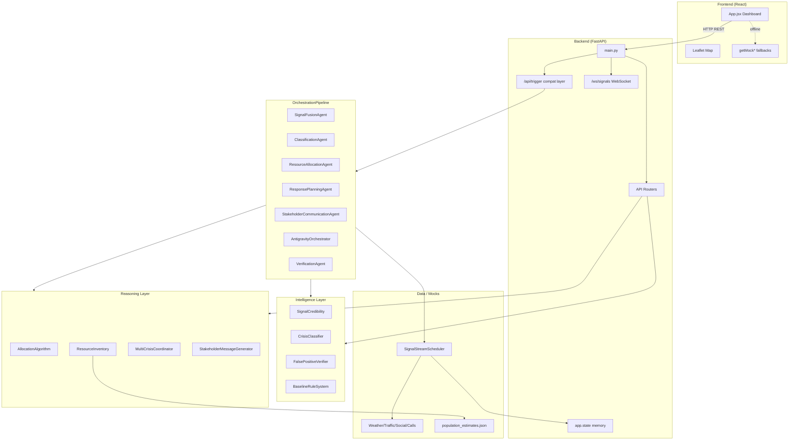
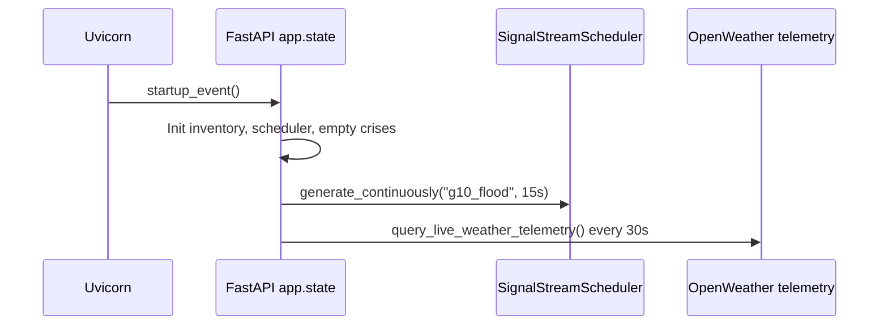
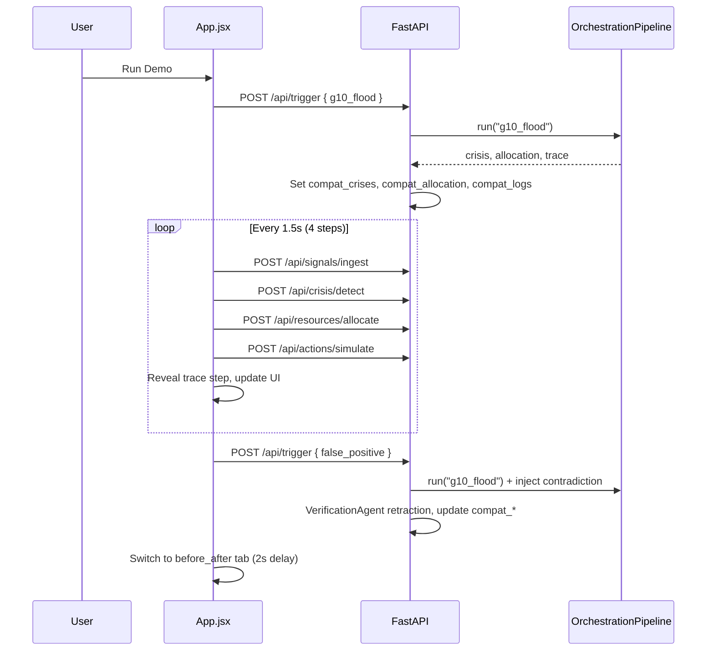

# CIRO — Crisis Intelligence & Response Orchestrator

**Complete project documentation** covering structure, functionality, architecture, workflows, API reference, and identified hardcoded behavior.

---

## Table of Contents

1. [Overview](#1-overview)
2. [Technology Stack](#2-technology-stack)
3. [Project Structure](#3-project-structure)
4. [System Architecture](#4-system-architecture)
5. [Agent Pipeline](#5-agent-pipeline)
6. [Backend Modules](#6-backend-modules)
7. [API Reference](#7-api-reference)
8. [Frontend Application](#8-frontend-application)
9. [Workflows](#9-workflows)
10. [Data Models & Static Data](#10-data-models--static-data)
11. [Environment & Running the Project](#11-environment--running-the-project)
12. [Application State](#12-application-state)
13. [Hardcoded Functionality Audit](#13-hardcoded-functionality-audit)
14. [Known Inconsistencies & Risks](#14-known-inconsistencies--risks)
15. [Related Documents](#15-related-documents)

---

## 1. Overview

**CIRO** (Crisis Intelligence & Response Orchestrator) is a full-stack demo system for **multi-source crisis detection**, **resource allocation**, **response planning**, **stakeholder messaging**, and **false-positive verification**. It is designed around a hackathon narrative: urban flooding in **G-10 Islamabad** concurrent with a **Gulberg heatwave**, followed by a **false-positive correction** (water main burst misclassified as flood).

The system combines:

- A **React + Vite** dashboard with map, live crisis cards, agent trace, and before/after comparison UI
- A **FastAPI** backend with modular intelligence, reasoning, and mock external data feeds
- A **seven-agent orchestration model** (six active in the local pipeline + VerificationAgent for contradictions)

**Important:** Much of the user-visible experience is **demo-scripted**. Real algorithms run underneath, but UI-facing numbers, narratives, and several API fallbacks are **pinned to fixed values** (see [Section 13](#13-hardcoded-functionality-audit)).

---

## 2. Technology Stack

| Layer | Technology |
|-------|------------|
| **Frontend** | React 19, Vite 8, Tailwind CSS 4, Leaflet (maps), Lucide React (icons) |
| **Backend** | Python 3, FastAPI, Uvicorn, Pydantic |
| **AI (optional)** | Google Gemini (`google-generativeai`) for stakeholder messages |
| **External APIs** | OpenWeatherMap (optional live weather telemetry) |
| **Real-time** | WebSocket (`/ws/signals`) for signal stream |
| **Testing** | pytest, pytest-asyncio, faker |

---

## 3. Project Structure

```
ciro-crisis-system/
├── PROJECT_DOCUMENTATION.md          # This file
├── CIRO_Complete_Build_Prompts_v2.md # Original build specification / prompts
├── hackathon_documents/              # Sprint task assignment (docx)
│
├── frontend/
│   ├── package.json
│   ├── vite.config.js
│   ├── index.html
│   ├── public/                       # favicon, icons
│   ├── dist/                         # Production build output
│   └── src/
│       ├── main.jsx                  # React entry
│       ├── App.jsx                   # Entire UI (single component)
│       ├── App.css
│       ├── index.css
│       └── assets/                   # hero.png, etc.
│   ├── .env.example                  # Template for frontend env vars
│
└── backend/
    ├── main.py                       # FastAPI app, startup, compat layer, WebSocket
    ├── requirements.txt
    ├── .env.example                  # Template for API keys
    ├── .gitignore                    # Ignores .env
    │
    ├── agents/
    │   └── agent_configs.py          # Agent definitions + OrchestrationPipeline
    │
    ├── api/
    │   ├── signals.py                # /api/signals/*
    │   ├── crisis.py                 # /api/crisis/*
    │   ├── resources.py              # /api/resources/*
    │   ├── actions.py                # /api/actions/*
    │   ├── alerts.py                 # /api/alerts/*
    │   └── debug.py                  # /api/debug/*
    │
    ├── intelligence/
    │   ├── credibility.py            # Signal scoring
    │   ├── classifier.py             # Crisis classification
    │   ├── verifier.py               # False-positive detection
    │   ├── baseline.py               # Straw-man comparator
    │   └── metrics.py                # Metric utilities
    │
    ├── reasoning/
    │   ├── allocation.py             # Resource allocation algorithm
    │   ├── resource_model.py         # Static inventory + travel times
    │   ├── multi_crisis.py           # Multi-crisis prioritization
    │   └── stakeholder_messages.py   # Urdu/English/Gemini messaging
    │
    ├── data/
    │   ├── generators.py             # Mock social/weather/traffic/call feeds
    │   ├── population_estimates.json # Zone populations
    │   └── flood_zones.json          # Flood zone reference data
    │
    └── models/
        ├── signal_models.py          # RawSignal, ScoredSignal, enums
        ├── crisis_models.py          # CrisisSchema, severity, types
        └── resource_models.py        # AllocationPlan, inventory types
```

**Note:** `backend/venv/` and `frontend/node_modules/` are local dependencies and are excluded from architectural documentation.

---

## 4. System Architecture

### 4.1 High-Level Diagram



### 4.2 Architectural Layers

| Layer | Responsibility |
|-------|----------------|
| **Presentation** | Single-page React app: tabs, demo controls, map visualization, trace viewer |
| **API / Transport** | FastAPI routers, CORS, middleware timing, WebSocket signal broadcast |
| **Compatibility** | `/api/trigger` + `compat_*` state — shapes responses for the demo UI |
| **Orchestration** | `OrchestrationPipeline.run()` — sequential local agent execution |
| **Intelligence** | Credibility scoring, classification, false-positive verification, baseline comparison |
| **Reasoning** | Resource allocation, multi-crisis coordination, stakeholder message generation |
| **Data simulation** | `generators.py` — synthetic external feeds; optional live OpenWeather |

### 4.3 Dual Trace Systems

The backend maintains **two** trace mechanisms:

| System | Storage | Used by |
|--------|---------|---------|
| **`trace_log`** | `app.state.trace_log` | API middleware via `append_trace()` on router calls |
| **`compat_logs`** | `app.state.compat_logs` | Frontend demo via `GET /api/trace` after `/api/trigger` |

The **demo UI** primarily consumes **`compat_logs`**, not the full `trace_log`.

---

## 5. Agent Pipeline

### 5.1 Agent Definitions

Seven agents are involved in the pipeline (six defined in `backend/agents/agent_configs.py` along with an explicit `AntigravityOrchestrator` step):

| Agent | Role |
|-------|------|
| **SignalFusionAgent** | Pull and score signals; cross-source correlation; anomaly detection |
| **ClassificationAgent** | Classify crisis type, severity, confidence, radius |
| **ResourceAllocationAgent** | Match crisis needs to inventory; ETAs; cap 60% per type |
| **ResponsePlanningAgent** | Generate operational actions and side effects |
| **StakeholderCommunicationAgent** | Urdu/English public, hospital, utility, media messages |
| **AntigravityOrchestrator** | Gemini-powered executive summary and validation of the pipeline actions |
| **VerificationAgent** | Contradiction scoring; retraction when score ≥ threshold |

**Local pipeline order** (`OrchestrationPipeline.run`):

1. SignalFusion → 2. Classification → 3. Allocation → 4. Response Planning → 5. Stakeholder Communication → 6. AntigravityOrchestrator

**VerificationAgent** runs in the **`false_positive`** compat scenario (injected contradiction signal), not inside the standard five-step pipeline return.

### 5.2 Pipeline Execution Entry Points

| Entry | Path | Description |
|-------|------|-------------|
| Local test | `GET /agents/run?scenario=` | Runs full pipeline; returns JSON result |
| Demo trigger | `POST /api/trigger` | Runs pipeline + populates `compat_*` for UI |
| Step-by-step demo | Frontend calls individual APIs after trigger | ingest → detect → allocate → simulate |

### 5.3 Supported Scenarios (Data Layer)

| Scenario ID | Description |
|-------------|-------------|
| `idle` | Reset state; no active crises |
| `g10_flood` | G-10 flood signals + weather + traffic + call spike |
| `gulberg_heatwave` | Heatwave social + call signals (Lahore) |
| `dual_crisis` | Combined flood + heatwave |
| `false_positive` | `g10_flood` + correction signals (water main) |
| `robustness_test` | Subset for stress testing |

**UI-exposed scenarios:** `idle`, `g10_flood`, `false_positive` only.

---

## 6. Backend Modules

### 6.1 `intelligence/`

| Module | Purpose |
|--------|---------|
| **`credibility.py`** | Scores signals using source weight, geo precision, mention frequency, recency |
| **`classifier.py`** | Keyword-based crisis type/severity; confidence and radius from signal batch |
| **`verifier.py`** | `RETRACTION_THRESHOLD = 0.60`; correction keywords; authoritative source boost |
| **`baseline.py`** | Simple rule-based comparator for CIRO vs baseline metrics |
| **`metrics.py`** | Clamp and normalization helpers |

### 6.2 `reasoning/`

| Module | Purpose |
|--------|---------|
| **`resource_model.py`** | ~47 static assets (ambulances, rescue, police, utilities); zones; travel-time matrix |
| **`allocation.py`** | `RESOURCE_RELEVANCE`, severity-based counts, `MAX_ALLOCATION_FRACTION = 0.60` |
| **`multi_crisis.py`** | Population-weighted priority across concurrent crises |
| **`stakeholder_messages.py`** | Template messages + optional Gemini generation |

### 6.3 `data/generators.py`

| Class | Simulates |
|-------|-----------|
| `SocialPostGenerator` | Urdu social posts (flood, heatwave, correction) |
| `WeatherMockAPI` | Rainfall/temperature; optional `get_real_weather()` via OpenWeather |
| `TrafficMockAPI` | Road closures, congestion, alternate routes |
| `EmergencyCallFeed` | Call volume spikes (18 or 12 calls/min) |
| `FloodZoneData` | Historical flood zone risk |
| `SignalStreamScheduler` | Bundles scenarios; continuous background generation |

### 6.4 `models/`

- **`signal_models.py`**: `RawSignal`, `ScoredSignal`, `SignalSource` enum
- **`crisis_models.py`**: `CrisisSchema`, `CrisisType`, `SeverityLevel`, `FalsePositiveResult`
- **`resource_models.py`**: `AllocationPlan`, deployment units, multi-crisis plans

---

## 7. API Reference

**Base URL (default):** `http://localhost:8000`  
**Frontend override:** `VITE_BACKEND_URL` environment variable

### 7.1 Core & Compatibility (`main.py`)

| Method | Path | Description |
|--------|------|-------------|
| `GET` | `/health` | Health check + timestamp |
| `GET` | `/agents/run?scenario=` | Run `OrchestrationPipeline` end-to-end |
| `POST` | `/api/trigger` | Body: `{ "scenario": "idle" \| "g10_flood" \| "false_positive" }` — demo state machine |
| `GET` | `/api/trace` | Returns `compat_logs` for frontend trace tab |
| `WS` | `/ws/signals` | Streams new signals from scheduler buffer (1s poll) |

### 7.2 Signals — prefix `/api/signals`

| Method | Path | Description |
|--------|------|-------------|
| `POST` | `/ingest` | Ingest and score a signal; keyword-based location defaults |
| `GET` | `/stream` | List scored signals in buffer |
| `POST` | `/trigger` | Load scenario signals into buffer |
| `DELETE` | `/clear` | Clear signal buffer |

### 7.3 Crisis — prefix `/api/crisis`

| Method | Path | Description |
|--------|------|-------------|
| `POST` | `/detect` | Classify from buffer; prefers `compat_crises` if set |
| `GET` | `/active` | List active crises |
| `GET` | `/{crisis_id}` | Get crisis by ID |
| `POST` | `/verify` | Verify contradiction signal against crisis |
| `POST` | `/retract/{crisis_id}` | Manual retraction |
| `DELETE` | `/clear` | Clear active crises |

### 7.4 Resources — prefix `/api/resources`

| Method | Path | Description |
|--------|------|-------------|
| `POST` | `/allocate` | Allocate for active crisis; uses compat strings if present |
| `POST` | `/allocate-multi` | Multi-crisis allocation plan |
| `GET` | `/inventory` | Inventory summary |
| `POST` | `/reset` | Reset all deployed units |
| `GET` | `/allocation/{plan_id}` | Get plan by ID |

### 7.5 Actions — prefix `/api/actions`

| Method | Path | Description |
|--------|------|-------------|
| `POST` | `/simulate` | Before/after stats + improvement metrics + actions |
| `GET` | `/before-after/{scenario}` | Scenario-specific before/after state |
| `GET` | `/trace` | Full `trace_log` |
| `POST` | `/trace/clear` | Clear trace log |

### 7.6 Alerts — prefix `/api/alerts`

| Method | Path | Description |
|--------|------|-------------|
| `POST` | `/broadcast` | Generate and store stakeholder messages |
| `GET` | `/messages/{crisis_id}` | Retrieve stored messages |
| `GET` | `/comparison` | CIRO vs baseline side-by-side report |

### 7.7 Debug — prefix `/api/debug`

| Method | Path | Description |
|--------|------|-------------|
| `POST` | `/weather-mode` | Toggle simulated vs live/mock weather |

---

## 8. Frontend Application

**Single file:** `frontend/src/App.jsx` (~930 lines)

### 8.1 Configuration

```javascript
const BACKEND_URL = import.meta.env.VITE_BACKEND_URL || 'http://localhost:8000';
```

Map tiles: Carto dark basemap (`basemaps.cartocdn.com`).

### 8.2 UI Tabs

| Tab ID | Purpose |
|--------|---------|
| `dashboard` | Crisis cards, allocation summary, unit stats, scenario-driven copy |
| `map` | Leaflet map — markers, optional green reroute polyline, rescue team pins |
| `trace` | Agent reasoning log (step-by-step reveal during demo) |
| `before_after` | Manual vs CIRO comparison (fixed marketing metrics in UI) |

### 8.3 State Variables

| State | Source |
|-------|--------|
| `scenario` | `idle` / `g10_flood` / `false_positive` |
| `crises` | API or `getMockCrises()` |
| `allocations`, `allocationReasoning` | API or `getMockAllocations()` |
| `actions` | API or `getMockActions()` |
| `traceLogs` / `visibleLogs` | `/api/trace` or `getMockTraceLogs()` |
| `currentStep`, `demoRunning` | Demo orchestration (1–7 steps) |

### 8.4 Demo Controls

- **Run Demo** — `runDemoMode()`: trigger → ingest → detect → allocate → simulate over timed steps
- **Reset** — `handleReset()`: `scenario: idle`, clears state, POST `/api/trigger`

### 8.5 Map Behavior (Hardcoded Visuals)

- Default center: `33.6844, 73.0479` (Islamabad G-10 region), zoom 12
- Marker coordinates: G-10 → `33.6938, 73.0652`; other → `33.6007, 73.0679`
- Alternate route polyline and three rescue team markers drawn for `g10_flood` / `false_positive` — **not from API**

---

## 9. Workflows

### 9.1 Application Startup (Backend)



On startup:

1. `ResourceInventory` and `SignalStreamScheduler` initialized
2. Background task generates **`g10_flood`** signals every **15 seconds**
3. Weather telemetry polls **Islamabad** every **30 seconds** (live or marks `weather_failed`)

### 9.2 Idle State

1. User loads app → `scenario = idle`
2. `useEffect` seeds **two decorative crisis cards** (not from API)
3. `POST /api/trigger { scenario: "idle" }` clears backend compat state

### 9.3 Full Demo Workflow (`g10_flood` → `false_positive`)



**Step timing (frontend):** 1500 ms between steps 1–4; 2000 ms before switching to Before/After tab.

**Demo signal ingest (hardcoded body):**

```json
{
  "source_type": "social",
  "content": "G-10 Islamabad flooding, Ring road blocked",
  "geo_precision": 0.95,
  "mention_frequency": 5
}
```

### 9.4 Signal Ingest → Detect → Allocate (API Path)

1. **Ingest** — Score signal; infer location from keywords (G-10, Gulberg/Lahore, Karachi)
2. **Detect** — `CrisisClassifier.classify()` on buffer; return `compat_crises` if populated
3. **Allocate** — `AllocationAlgorithm.allocate()`; format compat allocation strings
4. **Simulate** — Return canned before/after improvement metrics

### 9.5 False-Positive Verification Workflow

1. `POST /api/trigger { false_positive }`
2. Pipeline runs `g10_flood` first
3. Hardcoded **CDA water department** contradiction `RawSignal` injected
4. `FalsePositiveVerifier.verify()` → if score ≥ **0.60**, `retract_and_update()`
5. `compat_crises` updated to **Infrastructure — Water Main Burst**
6. Fixed `compat_actions` (WAPDA, retract advisory, Margalla Road, PIMS cancel)

### 9.6 WebSocket Signal Stream

Clients connect to `ws://localhost:8000/ws/signals`. Server sends new entries from `scheduler.buffer` every **1 second**. Used for live signal monitoring (not required for the main demo button flow).

### 9.7 CIRO vs Baseline Comparison

`GET /api/alerts/comparison`:

1. Uses last active crisis + allocation + messages
2. Falls back to `g10_flood` scenario signals if buffer empty
3. Runs `BaselineRuleSystem.process_signals()`
4. Returns formatted comparison with **`ciro_latency_ms: 28`** (hardcoded)

---

## 10. Data Models & Static Data

### 10.1 Crisis Types

`FLOOD`, `HEATWAVE`, `FIRE`, `ACCIDENT`, `INFRASTRUCTURE`, etc. (see `crisis_models.py`)

### 10.2 Severity Levels

`LOW`, `MEDIUM`, `HIGH`, `CRITICAL` — mapped to numeric scores for allocation priority.

### 10.3 `population_estimates.json`

| Zone | Population |
|------|------------|
| G-10 | 85,000 |
| Gulberg | 180,000 |
| Model Town | 95,000 |
| … | (13 zones total) |

Used by `MultiCrisisCoordinator` for priority scoring (`severity*2 + confidence + pop/100k`).

### 10.4 `flood_zones.json`

Reference flood zone data for generators / classification context.

### 10.5 Resource Inventory

`ResourceInventory` in `resource_model.py` defines static units with:

- Type (ambulance, rescue, police, water tanker, etc.)
- Zone (G-10, Gulberg, F-6, …)
- Fixed latitude/longitude
- `TRAVEL_TIMES` matrix between zones

---

## 11. Environment & Running the Project

### 11.1 Prerequisites

- **Node.js** (for frontend)
- **Python 3.10+** (for backend)
- Optional: OpenWeatherMap API key, Gemini API key

### 11.2 Backend Setup

```bash
cd backend
python -m venv venv
venv\Scripts\activate          # Windows
pip install -r requirements.txt
# Create .env with:
# WEATHER_API_KEY=...
# GEMINI_API_KEY=...
python main.py                 # or: uvicorn main:app --host 0.0.0.0 --port 8000 --reload
```

### 11.3 Frontend Setup

```bash
cd frontend
npm install
npm run dev                    # http://localhost:5173
```

Optional:

```bash
# .env.local in frontend/
VITE_BACKEND_URL=http://localhost:8000
```

### 11.4 Default Ports

| Service | Port |
|---------|------|
| FastAPI / Uvicorn | **8000** |
| Vite dev server | **5173** |

---

## 12. Application State

FastAPI `app.state` fields (in-memory, not persisted):

| Field | Type | Purpose |
|-------|------|---------|
| `inventory` | `ResourceInventory` | Deployable units |
| `scheduler` | `SignalStreamScheduler` | Signal buffer + generators |
| `active_crises` | `List[CrisisSchema]` | Current crises |
| `allocation_plans` | `Dict` | Plans by ID |
| `stakeholder_messages_store` | `Dict` | Messages by crisis ID |
| `trace_log` | `List` | Full API trace |
| `current_scenario` | `str` | Active scenario name |
| `compat_crises` | `List[dict]` | UI-shaped crisis cards |
| `compat_allocation` | `Dict[str, str]` | Human-readable allocation strings |
| `compat_reasoning` | `str` | Allocation explanation |
| `compat_actions` | `List[dict]` | Action list for UI |
| `compat_logs` | `List[dict]` | Agent trace for `/api/trace` |
| `weather_failed` | `bool` | Live weather health flag |

---

## 13. Hardcoded Functionality Audit

This section documents **all identified hardcoded behavior**, grouped by layer. Items marked **Demo** are intentional for the hackathon narrative; items marked **Core** are algorithm constants; items marked **Risk** need attention for production.

### 13.1 Summary Table

| Layer | Mostly hardcoded? | Role |
|-------|-------------------|------|
| Frontend mocks + demo delays | **Yes** | Offline resilience + scripted UX |
| `/api/trigger` compat layer | **Yes** | Pins UI numbers after partial real runs |
| `generators.py` MockAPIs | **Yes** | Simulates external feeds |
| Intelligence/reasoning constants | **Config-like** | Real math with fixed coefficients |
| `ResourceInventory` | **Yes** | Static world model |
| `/api/actions/simulate` metrics | **Yes** | Canned outcomes, not measured |
| Before/After UI tab | **Yes** | Marketing copy, not API-driven |

---

### 13.2 Frontend (`frontend/src/App.jsx`)

#### URLs & endpoints

| Lines (approx) | Hardcoded | Type |
|----------------|-----------|------|
| 25 | `BACKEND_URL` default `http://localhost:8000` | **Env fallback** |
| 59 | Carto dark tile URL | **External CDN** |
| 176–189 | Fixed API paths: `/api/trigger`, `/api/trace`, `/api/signals/ingest`, `/api/crisis/detect`, `/api/resources/allocate`, `/api/actions/simulate` | **Core wiring** |

#### Mock / fallback functions

| Function | Purpose |
|----------|---------|
| `getMockCrises(scen)` | Crisis cards for `g10_flood` / `false_positive` |
| `getMockAllocations(scen)` | Allocation strings per scenario |
| `getMockActions(scen)` | Four actions per scenario |
| `getMockTraceLogs()` | Seven agent steps with fixed narrative (credibility 0.82, threshold **0.6**, contradiction **0.71**, orchestrator validation) |

Used when API returns `null` (backend offline).

#### Scenarios & locations

| Item | Values |
|------|--------|
| Scenarios | `idle`, `g10_flood`, `false_positive` |
| Map center | `33.6844, 73.0479`, zoom 12 |
| Marker coords | G-10: `33.6938, 73.0652`; other: `33.6007, 73.0679` |
| Labels | G-10 Islamabad, Gulberg Islamabad, Ring Road, Margalla, PIMS, WAPDA, CDA |
| Route polyline | Fixed 4-point path (visual only) |
| Rescue teams | 3 fixed positions/names on map |

#### Demo timing

| Delay | Usage |
|-------|-------|
| **1500 ms** | Between demo steps 1–4 (nested `setTimeout`) |
| **2000 ms** | Before switching to `before_after` tab |

#### UI stats & idle behavior

| Item | Hardcoded behavior |
|------|-------------------|
| Units deployed | `0` (idle), `3` (false_positive), `7` (flood) — not from API |
| Idle `useEffect` | Clears active crises, showing a "No active crises detected" warning when `scenario === 'idle'` |
| Before/After tab | "47 min", "2.3 min", "95% Faster", fixed comparison rows — **not from `/api/actions/simulate`** |
| Trace display | `+{idx * 1.5}s delay` label (cosmetic) |

#### Ingest body (demo)

```json
{
  "source_type": "social",
  "content": "G-10 Islamabad flooding, Ring road blocked",
  "geo_precision": 0.95,
  "mention_frequency": 5
}
```

---

### 13.3 Backend Compatibility Layer (`main.py`)

#### Startup hardcoding

| Item | Value |
|------|-------|
| CORS | `allow_origins=["*"]` |
| Weather city | `"Islamabad"` only |
| Missing API key | `"invalid_dummy_key"` |
| Background scenario | `g10_flood` every **15s** (gated by `DEMO_MODE=true` env var) |
| Weather poll interval | **30s** |
| Startup delay before weather | **5s** |
| WebSocket poll | **1s** |
| Uvicorn | `0.0.0.0:8000` |

#### `POST /api/trigger` — `g10_flood`

Runs real `OrchestrationPipeline`, then **overwrites** UI state:

| Field | Pinned values |
|-------|---------------|
| Secondary crisis | Synthetic `gulberg_heatwave`, confidence **0.74**, location **Gulberg, Lahore** |
| `compat_crises` | Flood confidence **0.89**, radius **2.4**; heatwave **0.74**, radius **5.0** |
| `compat_allocation` | `"3 Rescue Teams + 2 Police Units + 2 Water Tankers/Pumps"`, `"1 Medical Outreach Unit"` |

#### `POST /api/trigger` — `false_positive`

| Item | Hardcoded |
|------|-----------|
| Contradiction signal | CDA water main burst on 7th Avenue G-10 (fixed content/coords) |
| `compat_crises` | Water main burst confidence **0.92**, radius **0.5** |
| `compat_allocation` | Utility repair teams string |
| `compat_actions` | 4 fixed actions (WAPDA, retract, Margalla, PIMS) |
| Step 6 log | Verification message with threshold **0.6** |

---

### 13.4 API Router Fallbacks

#### `api/crisis.py`

- Empty buffer → dummy `g10_flood` crisis (confidence **0.89**, G-10)
- `detect` prefers `compat_crises` over classifier output when set

#### `api/resources.py`

- Empty plan → `"3 Rescue Teams + 2 Police Units + 2 Water Tankers/Pumps"`

#### `api/actions.py`

| Metric | Hardcoded value |
|--------|-----------------|
| Traffic congestion (flood) | **340%** |
| Hazard reduction | **88.2%** |
| Lives saved (flood) | **48** |
| Evacuation efficiency | **96.5%** |
| Default actions | Reroute G-10, coordinate trauma services |

#### `api/alerts.py`

- Empty buffer → `get_scenario_signals("g10_flood")`
- `ciro_latency_ms` = **28**

#### `api/debug.py`

- Toggle `weather_failed` for simulated vs live weather mode

#### `api/signals.py` — ingest location defaults

| Keyword | Default location |
|---------|------------------|
| gulberg | Gulberg, Lahore |
| karachi | Karachi |
| (default) | G-10, Islamabad |

---

### 13.5 Data Generators (`backend/data/generators.py`)

#### Social posts (Urdu)

- **Flood:** 6 posts (G-10, Ring Road, urgency 0.7–1.0)
- **Heatwave:** 3 posts (Gulberg, Lahore, 43°C)
- **Correction:** 2 posts (water main, not flood)

#### WeatherMockAPI

| Scenario | Hardcoded |
|----------|-----------|
| Islamabad flood | **87.3 mm** rain, coords `33.6938, 73.0652` |
| Lahore heat | **43°C**, coords `33.6007, 73.0679` |

#### TrafficMockAPI

- Roads: G-10 Main Boulevard, Ring Road Exit 5, Margalla Road
- Congestion: SEVERE / HEAVY / MODERATE
- Alternate routes with fixed `added_time_min`

#### EmergencyCallFeed

- G-10: **18** calls/min; Gulberg: **12** calls/min

#### FloodZoneData

- Risk **CRITICAL** if `"G-10"` in location string

#### SignalStreamScheduler scenarios

| Scenario | Signal bundle |
|----------|-----------------|
| `g10_flood` | Social + weather + traffic + calls + flood zone |
| `gulberg_heatwave` | Heat social + calls |
| `dual_crisis` | Both |
| `false_positive` | g10_flood + correction posts |
| `robustness_test` | Traffic subset |

---

### 13.6 Intelligence Layer Constants

#### `credibility.py`

- Feature weights: **0.35 / 0.25 / 0.25 / 0.15**
- Source base scores: **0.95–0.60**
- Recency decay divisor: **60** (minutes)

#### `classifier.py`

- Urdu/English keyword lists per crisis type
- Severity thresholds from avg credibility + signal count
- Radius tables by type/severity
- `__main__` test fixtures for G-10 / Gulberg

#### `verifier.py`

- `RETRACTION_THRESHOLD = 0.60`
- `CORRECTION_KEYWORDS` map (water main burst → INFRASTRUCTURE, weights 0.30–0.45)
- Authoritative sources: `EMERGENCY_CALL`, `WEATHER_API`
- Authority boost **+0.15**, recency **+0.10**, credibility × **0.20**

#### `baseline.py`

- Simple keyword matching; generic alert template

---

### 13.7 Reasoning Layer Constants

#### `allocation.py`

- `RESOURCE_RELEVANCE` matrix by crisis type
- `SEVERITY_RESOURCE_COUNT` per severity level
- `MAX_ALLOCATION_FRACTION = 0.60`

#### `resource_model.py`

- **~47** static assets with fixed coordinates
- `TRAVEL_TIMES` zone matrix
- Default ETA **180** / **25** minutes when unknown

#### `multi_crisis.py`

- Loads `population_estimates.json`
- Default population **50,000** if zone missing
- Priority: `severity*2 + confidence + pop/100000`

#### `stakeholder_messages.py`

- Gemini model: `gemini-2.5-flash-preview-05-20`
- Urdu/English templates by crisis type
- Default ETA string **"15"** minutes

---

### 13.8 Agent Configs & Pipeline Actions

#### `agent_configs.py`

- Six agents with long `system_prompt` strings (threshold **0.6**, 60% cap, etc.)
- `OrchestrationPipeline` **flood** actions: Ring Road reroute, G-10 Markaz, PIMS, Urdu advisory
- **Heatwave** actions: Gulberg medical outreach, WASA tankers
- Side effects: Margalla congestion **+45%**, SMS delay **2 mins**

These actions are **scripted in code**, not generated by Gemini in the local pipeline.

---

### 13.9 Config & Secrets

| File | Content | Risk |
|------|---------|------|
| `backend/.env` | `WEATHER_API_KEY`, `GEMINI_API_KEY` | **Do not commit to public repositories** |
| No `VITE_BACKEND_URL` in `package.json` | Defaults to localhost | Documentation gap |

---

### 13.10 What Is NOT Fully Hardcoded

These components perform **dynamic computation** on ingested/scenario signals:

- Signal **credibility scoring**
- Crisis **classification** from signal batches
- **Resource allocation** over static inventory (real ETAs from travel matrix)
- **False-positive verification** when contradiction signal is provided
- **Stakeholder messages** (templates + optional Gemini)
- **Multi-crisis** priority ordering

---

## 14. Known Inconsistencies & Risks

### 14.1 Geography Mismatch

| Source | Gulberg label |
|--------|---------------|
| `generators.py`, classifier tests | **Gulberg, Lahore** |
| Frontend mocks, `compat_crises` | **Gulberg, Lahore** |

### 14.2 Misleading Idle UI

Idle mode displays two active-looking crisis cards that are **static placeholders**, not live detections.

### 14.3 Dual Trace Systems

Frontend demo uses `compat_logs`; API operations also write to `trace_log`. They are not always synchronized.

### 14.4 Security

- `.env` may contain plaintext API keys — rotate if the repository is shared
- CORS allows all origins (`*`) — acceptable for local demo only

### 14.5 Production Readiness Gaps

- No database persistence (all state in memory)
- No authentication / authorization
- Benchmark numbers (28 ms latency, 95% faster, 48 lives saved) are **narrative**, not measured
- Continuous `g10_flood` background generator runs even in `idle` UI state

---

## 15. Related Documents

| Document | Location | Description |
|----------|----------|-------------|
| Build prompts / spec | `CIRO_Complete_Build_Prompts_v2.md` | Original phased build instructions |
| Sprint assignment | `hackathon_documents/CIRO_Sprint_Task_Assignment (1).docx` | Task breakdown |
| Frontend README | `frontend/README.md` | Vite/React boilerplate notes |

---

## Document History

| Date | Change |
|------|--------|
| 2026-05-20 | Initial comprehensive documentation including hardcoded functionality audit |

---

*CIRO — Crisis Intelligence & Response Orchestrator · Project documentation*
