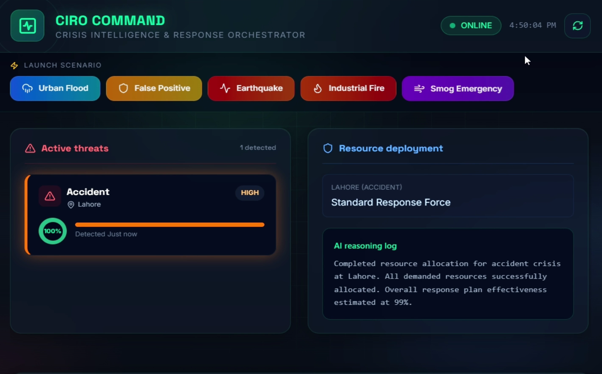

# 🚨 CIRO - Crisis Intelligence & Response Orchestrator

**CIRO** is an advanced, AI-powered **multi-source crisis detection and response orchestration system**. Built for speed, precision, and clarity during high-stakes emergencies, CIRO acts as a tactical command center that fuses real-time data, verifies signals, allocates resources, and coordinates stakeholder communication.

> **Hackathon Submission Note:** This repository contains the full-stack demo system designed to handle complex urban emergency scenarios (e.g., concurrent flooding and heatwaves) while automatically detecting and correcting false positives.

---

## Demo

[](https://github.com/user-attachments/assets/fcc8f95c-ba37-4e59-8001-0b572588b331)

## 📖 Documentation & Blueprints

- 🏗️ **[System Architecture & API Reference](PROJECT_DOCUMENTATION.md)** - Full technical breakdown, agent pipeline details, and workflow diagrams.
- 📱 **[Mobile App Blueprint](APP_DEVELOPMENT_BLUEPRINT.md)** - Technical roadmap for the offline-first mobile companion app.

---

## ✨ Key Features

- 🧠 **Agentic AI Pipeline**: A 7-agent orchestration pipeline (powered by Google Gemini) that handles signal fusion, crisis classification, resource allocation, and automated messaging.
- 🔍 **False-Positive Verification**: Automatically cross-references conflicting signals (e.g., social media panics vs. authoritative utility reports) to retract false alarms (e.g., misclassifying a water main burst as a flood).
- 🗺️ **Tactical Ops Center**: A dark-themed, data-dense React/Leaflet dashboard displaying live crisis cards, unit telemetry, and an agent trace reasoning log.
- 🚦 **Multi-Crisis Management**: Prioritizes resource allocation across concurrent, geographically distributed emergencies (e.g., G-10 Flood + Gulberg Heatwave).
- 💬 **Automated Stakeholder Comms**: Generates multi-lingual (English/Urdu) situation reports for the public, hospitals, and utilities.

---

## 🛠️ Technology Stack

- **Frontend:** React 19, Vite 8, Tailwind CSS 4, Leaflet
- **Backend:** Python 3.10+, FastAPI, Uvicorn, Pydantic
- **AI Integration:** Google Gemini (`google-generativeai`)
- **Real-Time Data:** WebSockets (`/ws/signals`), Mock/Live OpenWeather feeds

---

## 🚀 Quick Start (Local Development)

### 1. Backend Setup

```bash
cd backend
python -m venv venv
# Windows: venv\Scripts\activate | Mac/Linux: source venv/bin/activate
pip install -r requirements.txt

# Configure environment
cp .env.example .env
# Add your Google Gemini API key to .env (falls back to mock mode if omitted)

# Start the server
python -m uvicorn main:app --reload
# Runs on http://localhost:8000
```

### 2. Frontend Setup

```bash
cd frontend
npm install

# Configure environment
cp .env.example .env
# Set VITE_BACKEND_URL=http://localhost:8000

# Start the dev server
npm run dev
# Runs on http://localhost:5173
```

---

## 🌐 Deployment (Free-Tier Ready)

### Backend (Render)
1. Push this repository to GitHub.
2. In [Render Dashboard](https://dashboard.render.com) → **New Web Service** → Connect your repository.
3. Configure settings:
   - **Root Directory:** `backend`
   - **Build Command:** `pip install -r requirements.txt`
   - **Start Command:** `uvicorn main:app --host 0.0.0.0 --port $PORT`
4. Environment Variables:
   - `USE_GEMINI=false` (or true if using API key)
   - `DEMO_MODE=true`
   - `ALLOWED_ORIGINS=*` (update with your frontend URL after deploying)

### Frontend (Vercel / Netlify)
1. Import the repository in your hosting provider.
2. Set **Root Directory** to `frontend`.
3. Set Environment Variable: `VITE_BACKEND_URL=https://<your-render-url>.onrender.com`.
4. Ensure you do **not** use `build:mobile` for web deployment.

### Mobile App Build
To build the offline-capable APK using Capacitor, check out `frontend/MOBILE.md` and run `npm run build:mobile`.

---

## 🔒 Security Note
- Never commit `.env` files.
- Ensure any production deployments have properly configured `ALLOWED_ORIGINS` for CORS.
